# Opinion Poll by Datapraxis, 1–28 February 2026

<a href="#voting-intentions">Voting Intentions</a> | <a href="#seats">Seats</a> | <a href="#coalitions">Coalitions</a> | <a href="#technical-information">Technical Information</a>

## Voting Intentions

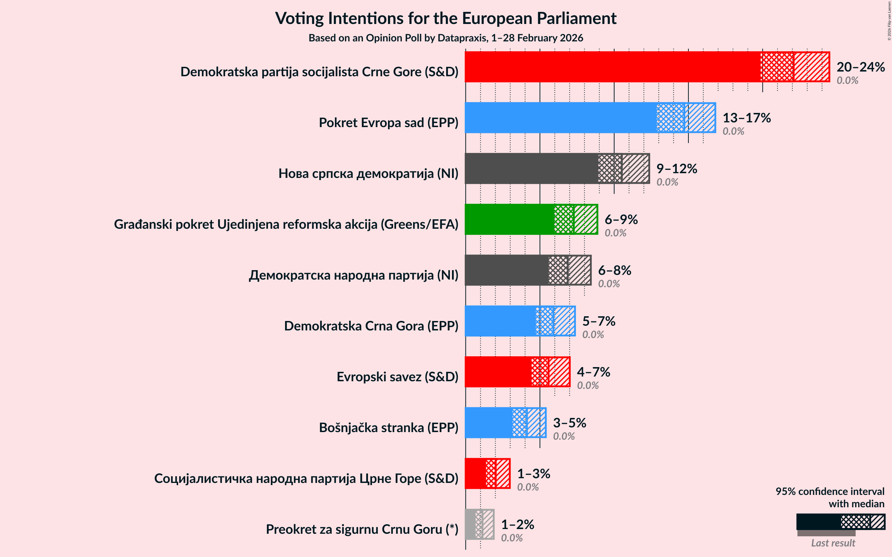

### Confidence Intervals

| Party | Last Result | Poll Result | 80% Confidence Interval | 90% Confidence Interval | 95% Confidence Interval | 99% Confidence Interval |
|:-----:|:-----------:|:-----------:|:-----------------------:|:-----------------------:|:-----------------------:|:-----------------------:|
| Demokratska partija socijalista Crne Gore (S&D) | 0.0% | 22.1% | 20.6–23.7% |20.2–24.1% |19.9–24.5% |19.2–25.3% |
| Pokret Evropa sad (EPP) | 0.0% | 14.7% | 13.5–16.1% |13.2–16.5% |12.9–16.8% |12.3–17.5% |
| Нова српска демократија (NI) | 0.0% | 10.5% | 9.5–11.7% |9.2–12.1% |8.9–12.4% |8.4–13.0% |
| Građanski pokret Ujedinjena reformska akcija (Greens/EFA) | 0.0% | 7.3% | 6.4–8.3% |6.2–8.6% |6.0–8.9% |5.6–9.4% |
| Демократска народна партија (NI) | 0.0% | 6.9% | 6.0–7.9% |5.8–8.2% |5.6–8.4% |5.2–8.9% |
| Demokratska Crna Gora (EPP) | 0.0% | 5.9% | 5.1–6.9% |4.9–7.1% |4.7–7.4% |4.4–7.8% |
| Evropski savez (S&D) | 0.0% | 5.6% | 4.8–6.5% |4.6–6.8% |4.4–7.0% |4.1–7.5% |
| Bošnjačka stranka (EPP) | 0.0% | 4.1% | 3.5–5.0% |3.3–5.2% |3.2–5.4% |2.9–5.8% |
| Социјалистичка народна партија Црне Горе (S&D) | 0.0% | 2.0% | 1.6–2.6% |1.5–2.8% |1.4–3.0% |1.2–3.3% |
| Preokret za sigurnu Crnu Goru (*) | 0.0% | 1.1% | 0.8–1.6% |0.7–1.8% |0.7–1.9% |0.5–2.2% |

*Note:* The poll result column reflects the actual value used in the calculations. Published results may vary slightly, and in addition be rounded to fewer digits.

## Seats

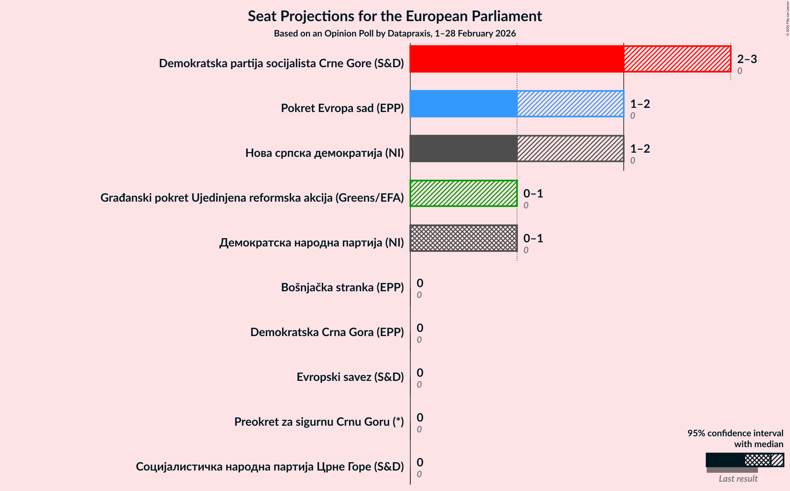

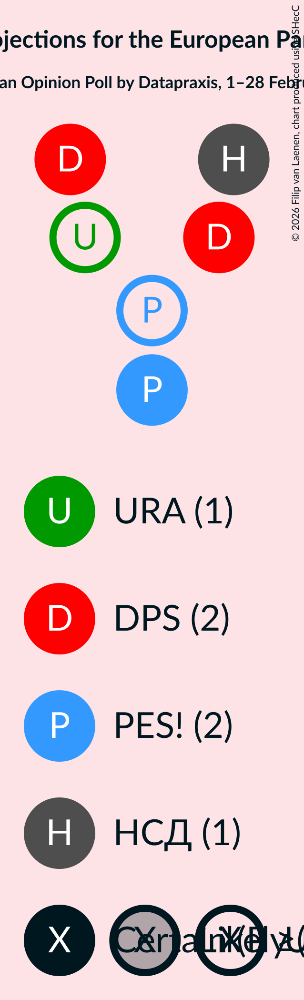

### Confidence Intervals

| Party | Last Result | Median | 80% Confidence Interval | 90% Confidence Interval | 95% Confidence Interval | 99% Confidence Interval |
|:-----:|:-----------:|:------:|:-----------------------:|:-----------------------:|:-----------------------:|:-----------------------:|
| <a href="#demokratska-partija-socijalista-crne-gore-(s&d)">Demokratska partija socijalista Crne Gore (S&D)</a> | 0 | 2 | 2 |2 |2 |2 |
| <a href="#pokret-evropa-sad-(epp)">Pokret Evropa sad (EPP)</a> | 0 | 1 | 1 |1 |1 |1 |
| <a href="#нова-српска-демократија-(ni)">Нова српска демократија (NI)</a> | 0 | 1 | 1 |1 |1 |1 |
| <a href="#građanski-pokret-ujedinjena-reformska-akcija-(greens/efa)">Građanski pokret Ujedinjena reformska akcija (Greens/EFA)</a> | 0 | 0 | 0 |0 |0 |0–1 |
| <a href="#демократска-народна-партија-(ni)">Демократска народна партија (NI)</a> | 0 | 0 | 0 |0 |0 |0 |
| <a href="#demokratska-crna-gora-(epp)">Demokratska Crna Gora (EPP)</a> | 0 | 0 | 0 |0 |0 |0 |
| <a href="#evropski-savez-(s&d)">Evropski savez (S&D)</a> | 0 | 0 | 0 |0 |0 |0 |
| <a href="#bošnjačka-stranka-(epp)">Bošnjačka stranka (EPP)</a> | 0 | 0 | 0 |0 |0 |0 |
| <a href="#социјалистичка-народна-партија-црне-горе-(s&d)">Социјалистичка народна партија Црне Горе (S&D)</a> | 0 | 0 | 0 |0 |0 |0 |
| <a href="#preokret-za-sigurnu-crnu-goru-(*)">Preokret za sigurnu Crnu Goru (*)</a> | 0 | 0 | 0 |0 |0 |0 |

### Demokratska partija socijalista Crne Gore (S&D)

*For a full overview of the results for this party, see the [Demokratska partija socijalista Crne Gore (S&D)](party-demokratskapartijasocijalistacrnegoresd.html) page.*

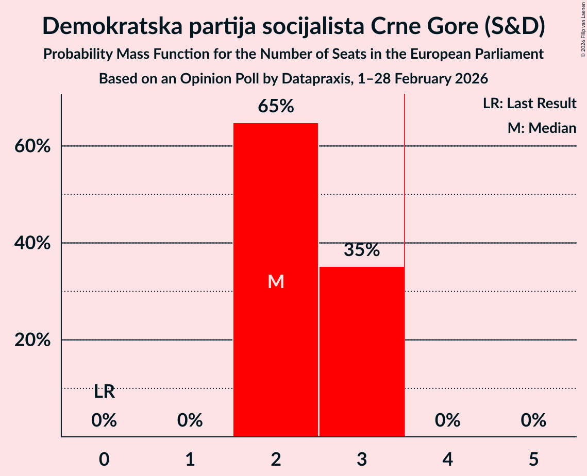

| Number of Seats | Probability | Accumulated | Special Marks |
|:---------------:|:-----------:|:-----------:|:-------------:|
| 0 | 0% | 100% | Last Result |
| 1 | 0% | 100% |  |
| 2 | 99.9% | 100% | Median |
| 3 | 0.1% | 0.1% |  |
| 4 | 0% | 0% | Majority |

### Pokret Evropa sad (EPP)

*For a full overview of the results for this party, see the [Pokret Evropa sad (EPP)](party-pokretevropasadepp.html) page.*

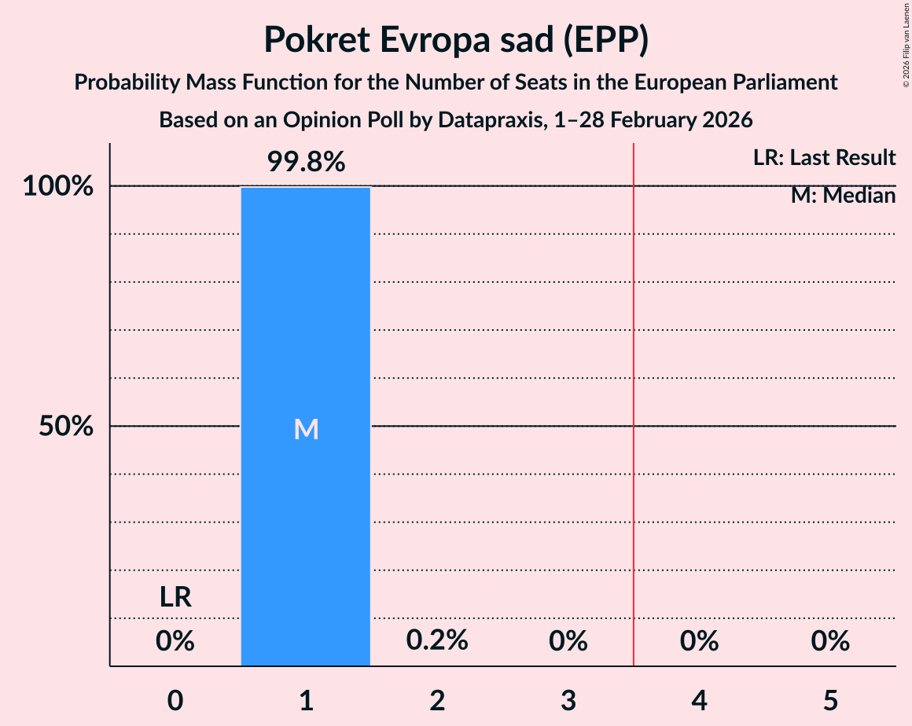

| Number of Seats | Probability | Accumulated | Special Marks |
|:---------------:|:-----------:|:-----------:|:-------------:|
| 0 | 0% | 100% | Last Result |
| 1 | 99.9% | 100% | Median |
| 2 | 0.1% | 0.1% |  |
| 3 | 0% | 0% |  |

### Нова српска демократија (NI)

*For a full overview of the results for this party, see the [Нова српска демократија (NI)](party-новасрпскадемократијаni.html) page.*

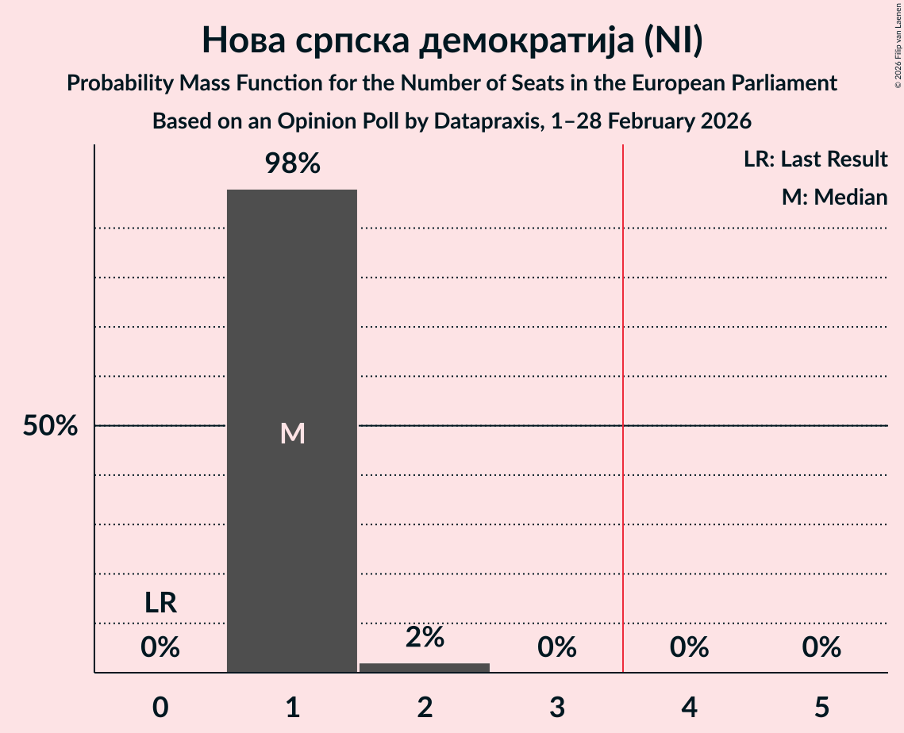

| Number of Seats | Probability | Accumulated | Special Marks |
|:---------------:|:-----------:|:-----------:|:-------------:|
| 0 | 0.4% | 100% | Last Result |
| 1 | 99.6% | 99.6% | Median |
| 2 | 0% | 0% |  |

### Građanski pokret Ujedinjena reformska akcija (Greens/EFA)

*For a full overview of the results for this party, see the [Građanski pokret Ujedinjena reformska akcija (Greens/EFA)](party-građanskipokretujedinjenareformskaakcijagreensefa.html) page.*

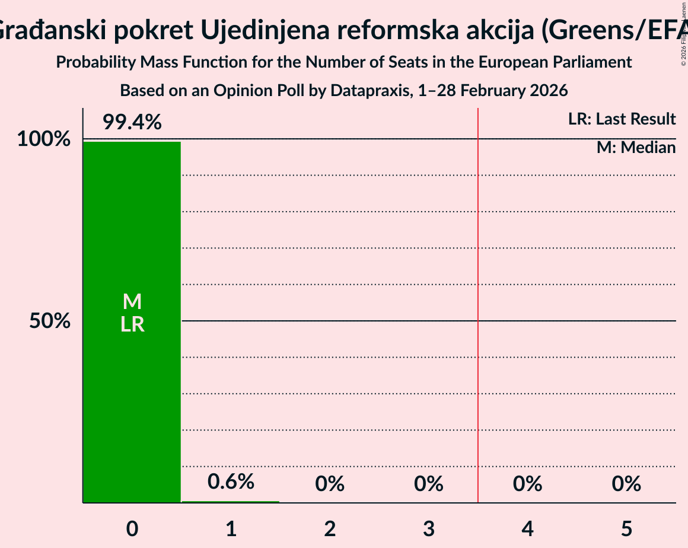

| Number of Seats | Probability | Accumulated | Special Marks |
|:---------------:|:-----------:|:-----------:|:-------------:|
| 0 | 99.4% | 100% | Last Result, Median |
| 1 | 0.6% | 0.6% |  |
| 2 | 0% | 0% |  |

### Демократска народна партија (NI)

*For a full overview of the results for this party, see the [Демократска народна партија (NI)](party-демократсканароднапартијаni.html) page.*

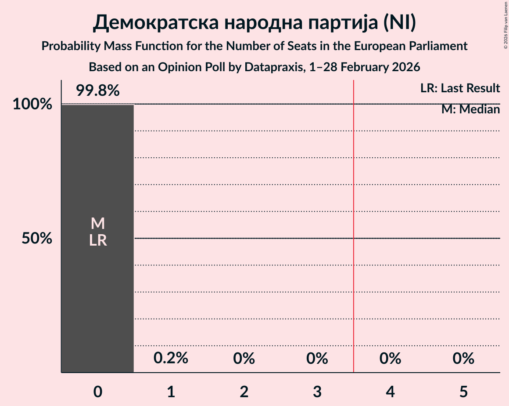

| Number of Seats | Probability | Accumulated | Special Marks |
|:---------------:|:-----------:|:-----------:|:-------------:|
| 0 | 99.8% | 100% | Last Result, Median |
| 1 | 0.2% | 0.2% |  |
| 2 | 0% | 0% |  |

### Demokratska Crna Gora (EPP)

*For a full overview of the results for this party, see the [Demokratska Crna Gora (EPP)](party-demokratskacrnagoraepp.html) page.*

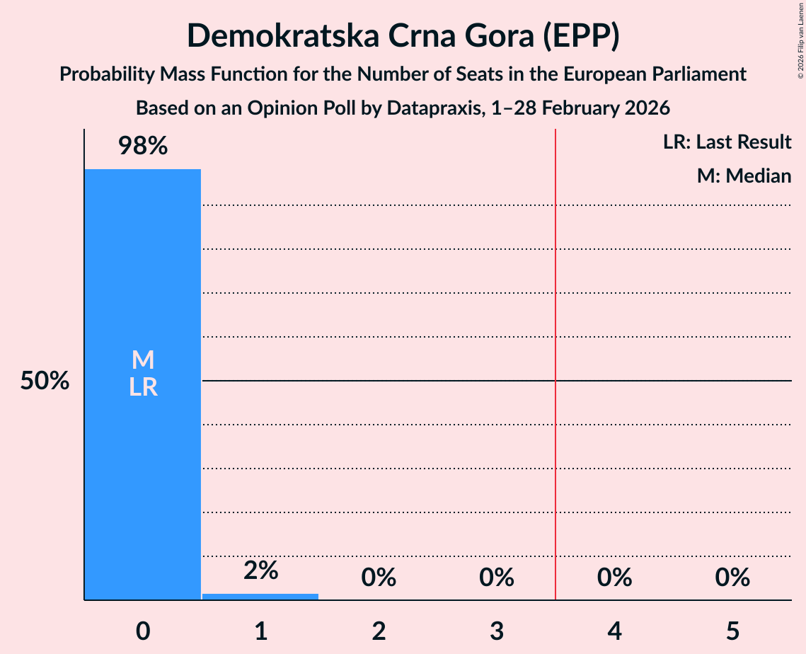

| Number of Seats | Probability | Accumulated | Special Marks |
|:---------------:|:-----------:|:-----------:|:-------------:|
| 0 | 100% | 100% | Last Result, Median |

### Evropski savez (S&D)

*For a full overview of the results for this party, see the [Evropski savez (S&D)](party-evropskisavezsd.html) page.*

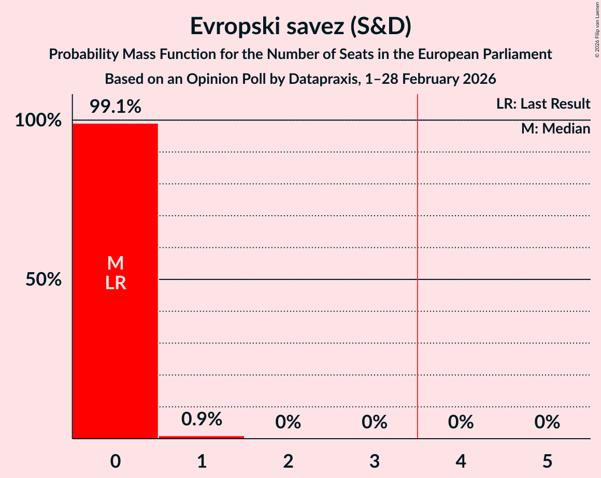

| Number of Seats | Probability | Accumulated | Special Marks |
|:---------------:|:-----------:|:-----------:|:-------------:|
| 0 | 100% | 100% | Last Result, Median |

### Bošnjačka stranka (EPP)

*For a full overview of the results for this party, see the [Bošnjačka stranka (EPP)](party-bošnjačkastrankaepp.html) page.*

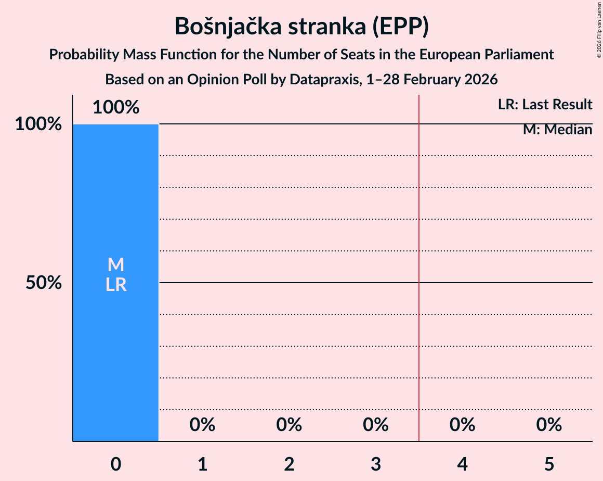

| Number of Seats | Probability | Accumulated | Special Marks |
|:---------------:|:-----------:|:-----------:|:-------------:|
| 0 | 100% | 100% | Last Result, Median |

### Социјалистичка народна партија Црне Горе (S&D)

*For a full overview of the results for this party, see the [Социјалистичка народна партија Црне Горе (S&D)](party-социјалистичканароднапартијацрнегореsd.html) page.*

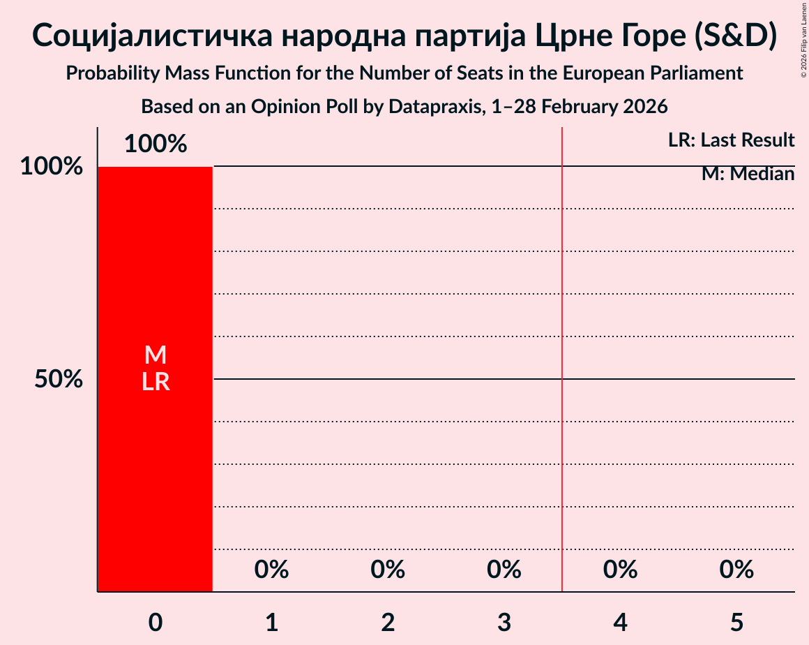

| Number of Seats | Probability | Accumulated | Special Marks |
|:---------------:|:-----------:|:-----------:|:-------------:|
| 0 | 100% | 100% | Last Result, Median |

### Preokret za sigurnu Crnu Goru (*)

*For a full overview of the results for this party, see the [Preokret za sigurnu Crnu Goru (*)](party-preokretzasigurnucrnugoru.html) page.*

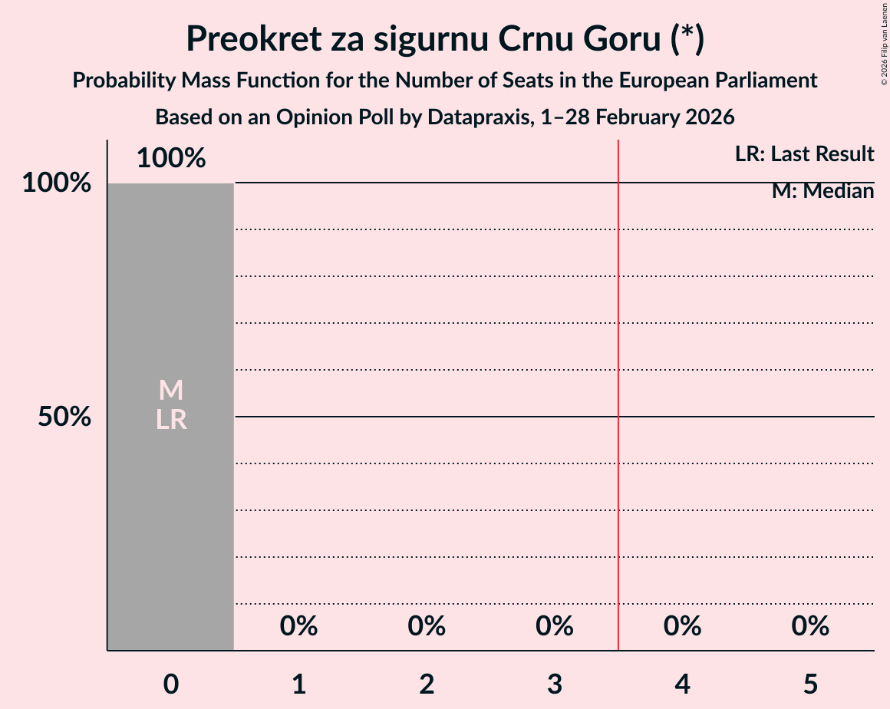

| Number of Seats | Probability | Accumulated | Special Marks |
|:---------------:|:-----------:|:-----------:|:-------------:|
| 0 | 100% | 100% | Last Result, Median |

## Coalitions

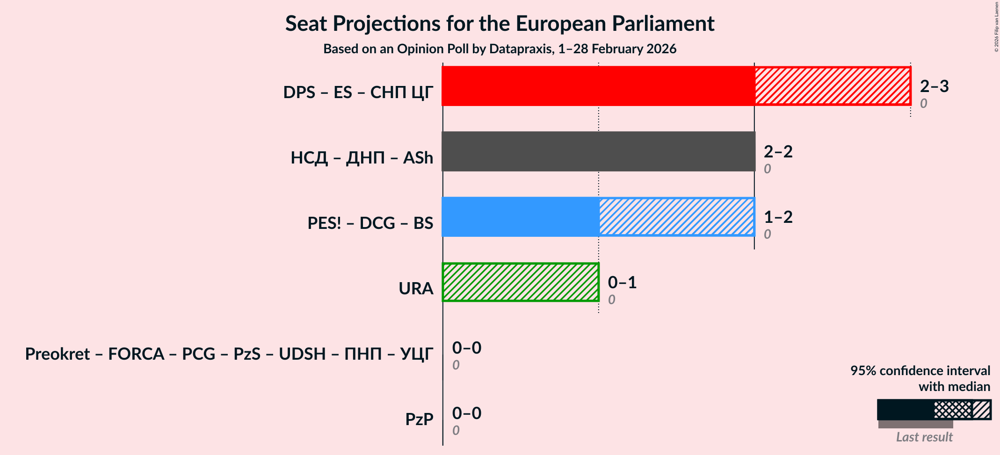

### Confidence Intervals

| Coalition | Last Result | Median | Majority? | 80% Confidence Interval | 90% Confidence Interval | 95% Confidence Interval | 99% Confidence Interval |
|:---------:|:-----------:|:------:|:---------:|:-----------------------:|:-----------------------:|:-----------------------:|:-----------------------:|
| Pokret Evropa sad (EPP) – Demokratska Crna Gora (EPP) – Bošnjačka stranka (EPP) | 0 | 1 | 0% | 1 | 1 | 1 | 1 |
| Građanski pokret Ujedinjena reformska akcija (Greens/EFA) | 0 | 0 | 0% | 0 | 0 | 0 | 0–1 |

### Pokret Evropa sad (EPP) – Demokratska Crna Gora (EPP) – Bošnjačka stranka (EPP)

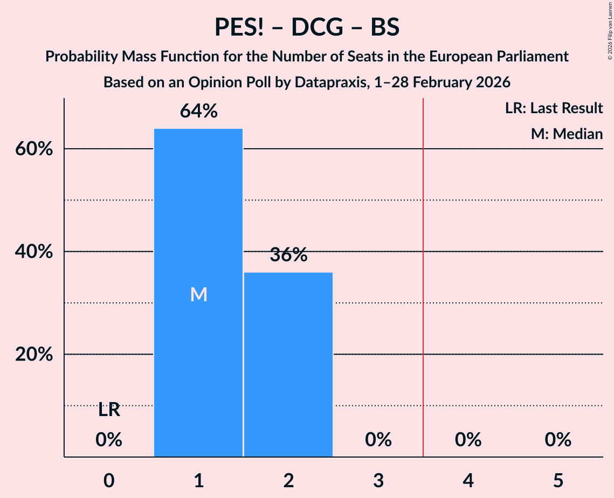

| Number of Seats | Probability | Accumulated | Special Marks |
|:---------------:|:-----------:|:-----------:|:-------------:|
| 0 | 0% | 100% | Last Result |
| 1 | 99.9% | 100% | Median |
| 2 | 0.1% | 0.1% |  |
| 3 | 0% | 0% |  |

### Građanski pokret Ujedinjena reformska akcija (Greens/EFA)

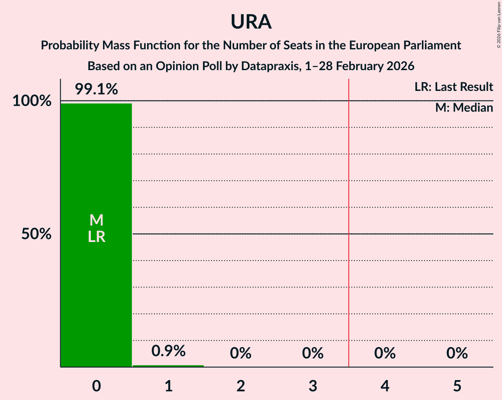

| Number of Seats | Probability | Accumulated | Special Marks |
|:---------------:|:-----------:|:-----------:|:-------------:|
| 0 | 99.4% | 100% | Last Result, Median |
| 1 | 0.6% | 0.6% |  |
| 2 | 0% | 0% |  |

## Technical Information

### Opinion Poll

+ **Polling firm:** Datapraxis
+ **Commissioner(s):** —
+ **Fieldwork period:** 1–28 February 2026

### Calculations

+ **Sample size:** 1236
+ **Simulations done:** 1,048,576
+ **Error estimate:** 1.25%

