# Opinion Poll by Spektrum Analitika, 11–23 April 2026

<a href="#voting-intentions">Voting Intentions</a> | <a href="#seats">Seats</a> | <a href="#coalitions">Coalitions</a> | <a href="#technical-information">Technical Information</a>

## Voting Intentions

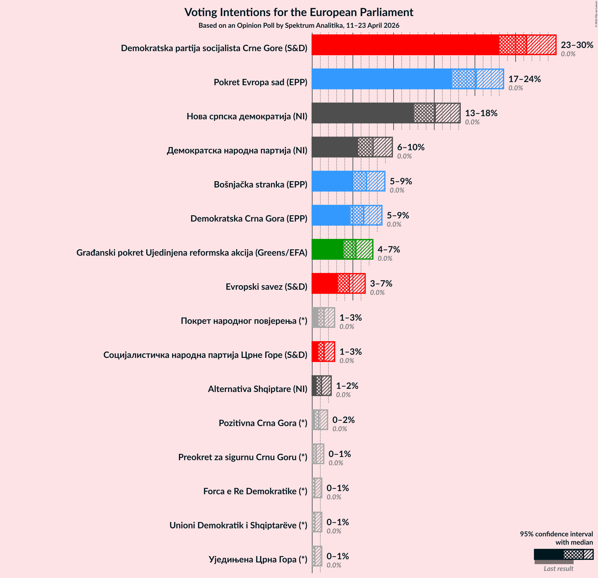

### Confidence Intervals

| Party | Last Result | Poll Result | 80% Confidence Interval | 90% Confidence Interval | 95% Confidence Interval | 99% Confidence Interval |
|:-----:|:-----------:|:-----------:|:-----------------------:|:-----------------------:|:-----------------------:|:-----------------------:|
| Demokratska partija socijalista Crne Gore (S&D) | 0.0% | 26.3% | 24.2–28.7% |23.5–29.4% |23.0–30.0% |22.0–31.1% |
| Pokret Evropa sad (EPP) | 0.0% | 20.2% | 18.2–22.4% |17.6–23.0% |17.2–23.5% |16.3–24.6% |
| Нова српска демократија (NI) | 0.0% | 15.1% | 13.4–17.1% |12.9–17.7% |12.5–18.2% |11.7–19.2% |
| Демократска народна партија (NI) | 0.0% | 7.5% | 6.3–9.0% |5.9–9.4% |5.7–9.8% |5.1–10.6% |
| Bošnjačka stranka (EPP) | 0.0% | 6.7% | 5.5–8.1% |5.2–8.6% |5.0–8.9% |4.5–9.7% |
| Demokratska Crna Gora (EPP) | 0.0% | 6.3% | 5.2–7.8% |4.9–8.2% |4.7–8.6% |4.2–9.3% |
| Građanski pokret Ujedinjena reformska akcija (Greens/EFA) | 0.0% | 5.4% | 4.4–6.7% |4.1–7.1% |3.8–7.5% |3.4–8.1% |
| Evropski savez (S&D) | 0.0% | 4.6% | 3.6–5.8% |3.4–6.2% |3.2–6.5% |2.8–7.2% |
| Покрет народног повјерења (*) | 0.0% | 1.5% | 1.0–2.3% |0.9–2.5% |0.8–2.8% |0.6–3.2% |
| Социјалистичка народна партија Црне Горе (S&D) | 0.0% | 1.5% | 1.0–2.3% |0.9–2.5% |0.8–2.8% |0.6–3.2% |
| Alternativa Shqiptare (NI) | 0.0% | 1.1% | 0.7–1.9% |0.6–2.1% |0.5–2.3% |0.4–2.8% |
| Pozitivna Crna Gora (*) | 0.0% | 0.8% | 0.5–1.5% |0.4–1.7% |0.4–1.9% |0.2–2.3% |
| Preokret za sigurnu Crnu Goru (*) | 0.0% | 0.5% | 0.3–1.1% |0.2–1.3% |0.2–1.4% |0.1–1.8% |
| Forca e Re Demokratike (*) | 0.0% | 0.3% | 0.2–0.9% |0.1–1.0% |0.1–1.2% |0.0–1.5% |
| Unioni Demokratik i Shqiptarëve (*) | 0.0% | 0.3% | 0.2–0.9% |0.1–1.0% |0.1–1.2% |0.0–1.5% |
| Уједињена Црна Гора (*) | 0.0% | 0.3% | 0.2–0.9% |0.1–1.0% |0.1–1.2% |0.0–1.5% |

*Note:* The poll result column reflects the actual value used in the calculations. Published results may vary slightly, and in addition be rounded to fewer digits.

## Seats

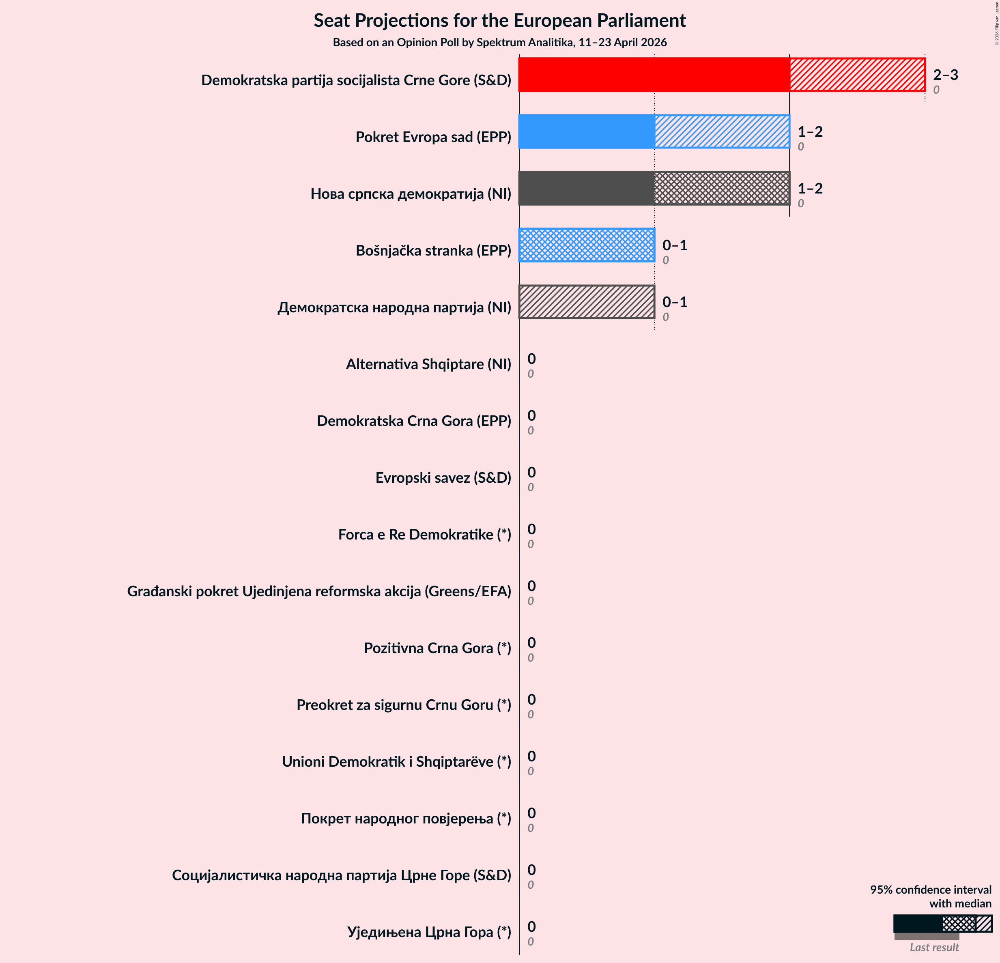

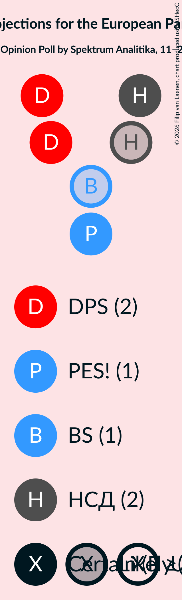

### Confidence Intervals

| Party | Last Result | Median | 80% Confidence Interval | 90% Confidence Interval | 95% Confidence Interval | 99% Confidence Interval |
|:-----:|:-----------:|:------:|:-----------------------:|:-----------------------:|:-----------------------:|:-----------------------:|
| <a href="#demokratska-partija-socijalista-crne-gore-(s&d)">Demokratska partija socijalista Crne Gore (S&D)</a> | 0 | 2 | 2–3 |2–3 |2–3 |2–3 |
| <a href="#pokret-evropa-sad-(epp)">Pokret Evropa sad (EPP)</a> | 0 | 2 | 2 |2 |1–2 |1–2 |
| <a href="#нова-српска-демократија-(ni)">Нова српска демократија (NI)</a> | 0 | 1 | 1 |1 |1 |1 |
| <a href="#демократска-народна-партија-(ni)">Демократска народна партија (NI)</a> | 0 | 0 | 0 |0 |0–1 |0–1 |
| <a href="#bošnjačka-stranka-(epp)">Bošnjačka stranka (EPP)</a> | 0 | 1 | 0–1 |0–1 |0–1 |0–1 |
| <a href="#demokratska-crna-gora-(epp)">Demokratska Crna Gora (EPP)</a> | 0 | 0 | 0 |0 |0 |0 |
| <a href="#građanski-pokret-ujedinjena-reformska-akcija-(greens/efa)">Građanski pokret Ujedinjena reformska akcija (Greens/EFA)</a> | 0 | 0 | 0 |0 |0 |0 |
| <a href="#evropski-savez-(s&d)">Evropski savez (S&D)</a> | 0 | 0 | 0 |0 |0 |0 |
| <a href="#покрет-народног-повјерења-(*)">Покрет народног повјерења (*)</a> | 0 | 0 | 0 |0 |0 |0 |
| <a href="#социјалистичка-народна-партија-црне-горе-(s&d)">Социјалистичка народна партија Црне Горе (S&D)</a> | 0 | 0 | 0 |0 |0 |0 |
| <a href="#alternativa-shqiptare-(ni)">Alternativa Shqiptare (NI)</a> | 0 | 0 | 0 |0 |0 |0 |
| <a href="#pozitivna-crna-gora-(*)">Pozitivna Crna Gora (*)</a> | 0 | 0 | 0 |0 |0 |0 |
| <a href="#preokret-za-sigurnu-crnu-goru-(*)">Preokret za sigurnu Crnu Goru (*)</a> | 0 | 0 | 0 |0 |0 |0 |
| <a href="#forca-e-re-demokratike-(*)">Forca e Re Demokratike (*)</a> | 0 | 0 | 0 |0 |0 |0 |
| <a href="#unioni-demokratik-i-shqiptarëve-(*)">Unioni Demokratik i Shqiptarëve (*)</a> | 0 | 0 | 0 |0 |0 |0 |
| <a href="#уједињена-црна-гора-(*)">Уједињена Црна Гора (*)</a> | 0 | 0 | 0 |0 |0 |0 |

### Demokratska partija socijalista Crne Gore (S&D)

*For a full overview of the results for this party, see the [Demokratska partija socijalista Crne Gore (S&D)](party-demokratskapartijasocijalistacrnegoresd.html) page.*

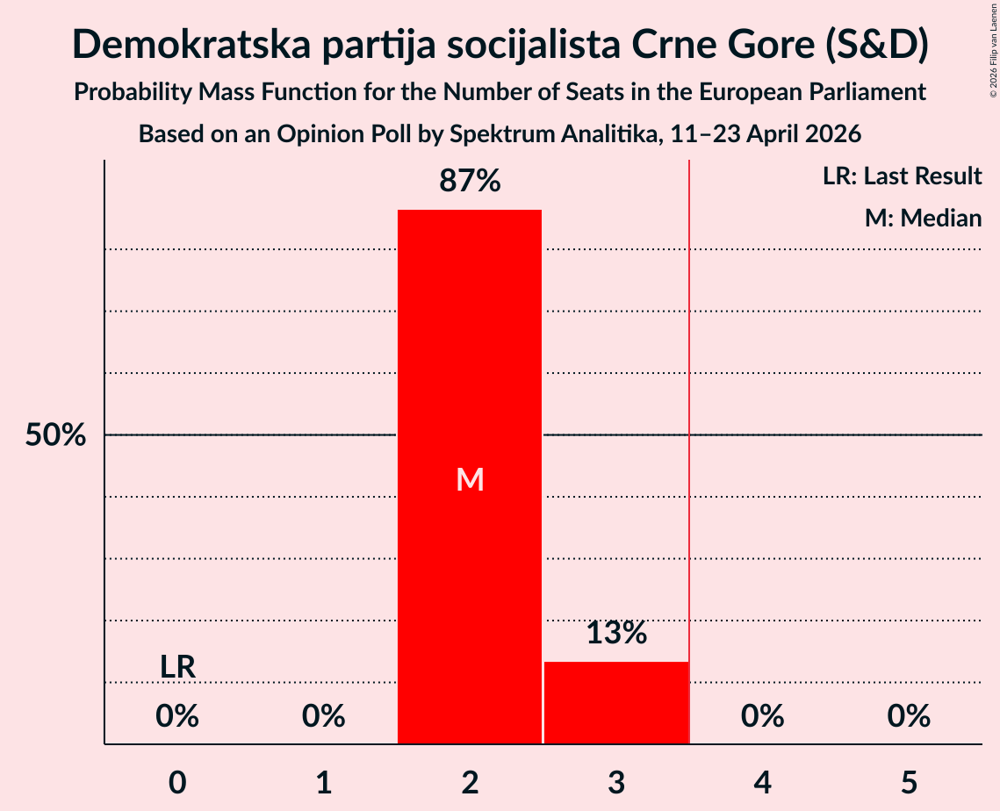

| Number of Seats | Probability | Accumulated | Special Marks |
|:---------------:|:-----------:|:-----------:|:-------------:|
| 0 | 0% | 100% | Last Result |
| 1 | 0% | 100% |  |
| 2 | 87% | 100% | Median |
| 3 | 13% | 13% |  |
| 4 | 0% | 0% | Majority |

### Pokret Evropa sad (EPP)

*For a full overview of the results for this party, see the [Pokret Evropa sad (EPP)](party-pokretevropasadepp.html) page.*

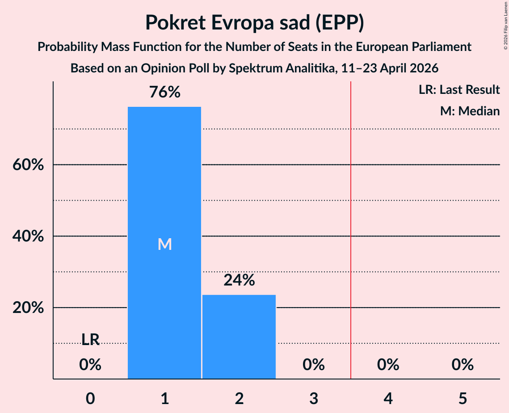

| Number of Seats | Probability | Accumulated | Special Marks |
|:---------------:|:-----------:|:-----------:|:-------------:|
| 0 | 0% | 100% | Last Result |
| 1 | 5% | 100% |  |
| 2 | 95% | 95% | Median |
| 3 | 0.1% | 0.1% |  |
| 4 | 0% | 0% | Majority |

### Нова српска демократија (NI)

*For a full overview of the results for this party, see the [Нова српска демократија (NI)](party-новасрпскадемократијаni.html) page.*

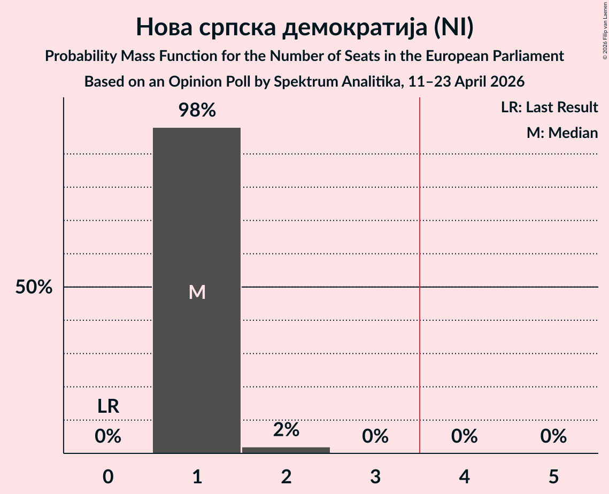

| Number of Seats | Probability | Accumulated | Special Marks |
|:---------------:|:-----------:|:-----------:|:-------------:|
| 0 | 0% | 100% | Last Result |
| 1 | 99.8% | 100% | Median |
| 2 | 0.2% | 0.2% |  |
| 3 | 0% | 0% |  |

### Демократска народна партија (NI)

*For a full overview of the results for this party, see the [Демократска народна партија (NI)](party-демократсканароднапартијаni.html) page.*

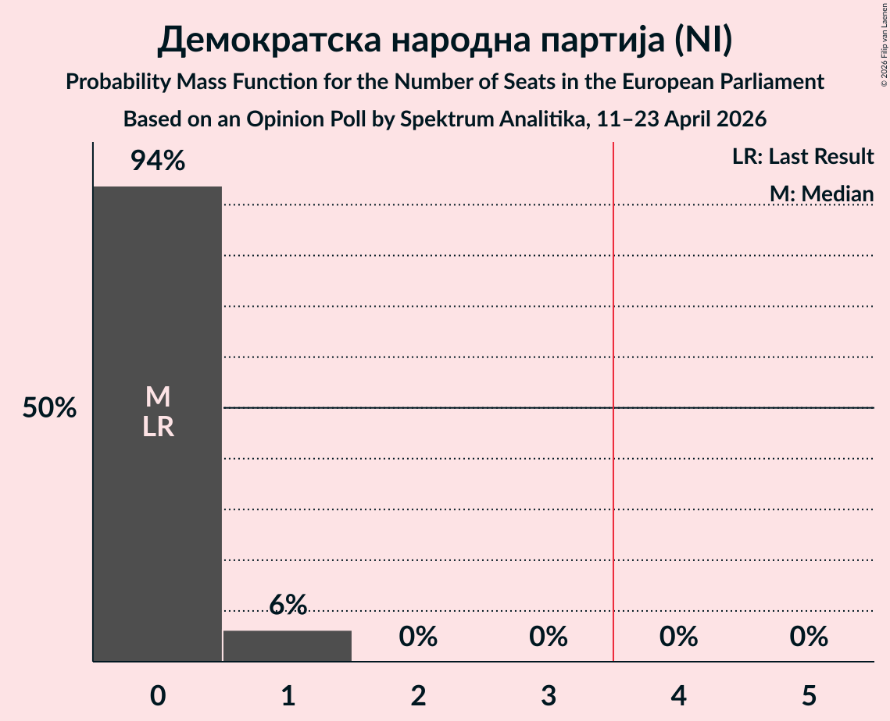

| Number of Seats | Probability | Accumulated | Special Marks |
|:---------------:|:-----------:|:-----------:|:-------------:|
| 0 | 95% | 100% | Last Result, Median |
| 1 | 5% | 5% |  |
| 2 | 0% | 0% |  |

### Bošnjačka stranka (EPP)

*For a full overview of the results for this party, see the [Bošnjačka stranka (EPP)](party-bošnjačkastrankaepp.html) page.*

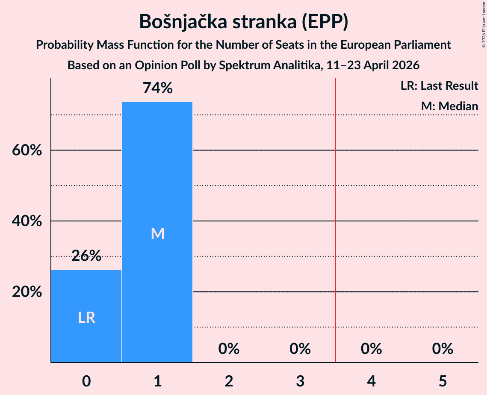

| Number of Seats | Probability | Accumulated | Special Marks |
|:---------------:|:-----------:|:-----------:|:-------------:|
| 0 | 14% | 100% | Last Result |
| 1 | 86% | 86% | Median |
| 2 | 0% | 0% |  |

### Demokratska Crna Gora (EPP)

*For a full overview of the results for this party, see the [Demokratska Crna Gora (EPP)](party-demokratskacrnagoraepp.html) page.*

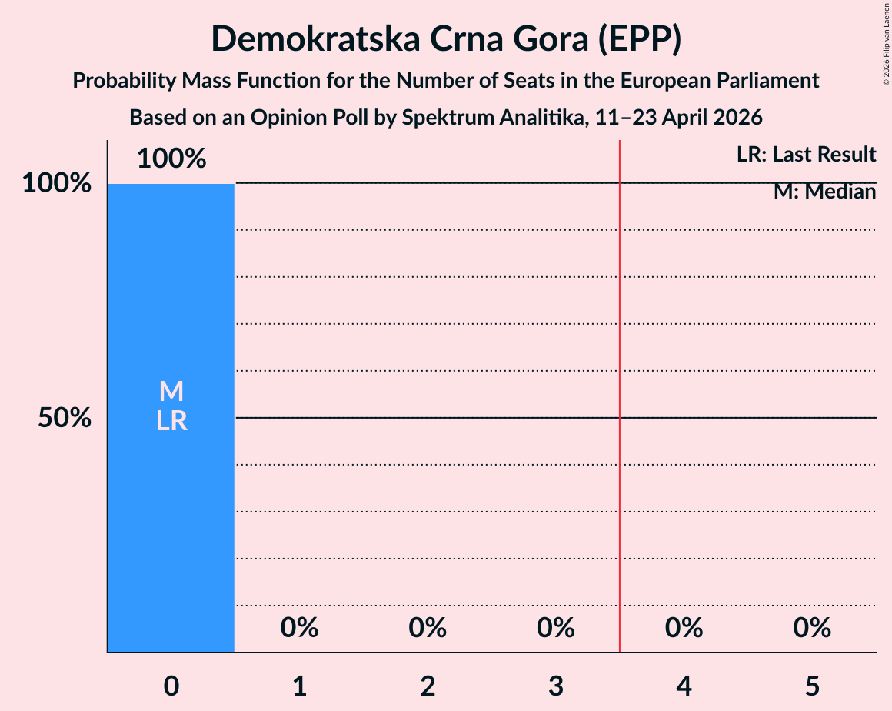

| Number of Seats | Probability | Accumulated | Special Marks |
|:---------------:|:-----------:|:-----------:|:-------------:|
| 0 | 99.9% | 100% | Last Result, Median |
| 1 | 0.1% | 0.1% |  |
| 2 | 0% | 0% |  |

### Građanski pokret Ujedinjena reformska akcija (Greens/EFA)

*For a full overview of the results for this party, see the [Građanski pokret Ujedinjena reformska akcija (Greens/EFA)](party-građanskipokretujedinjenareformskaakcijagreensefa.html) page.*

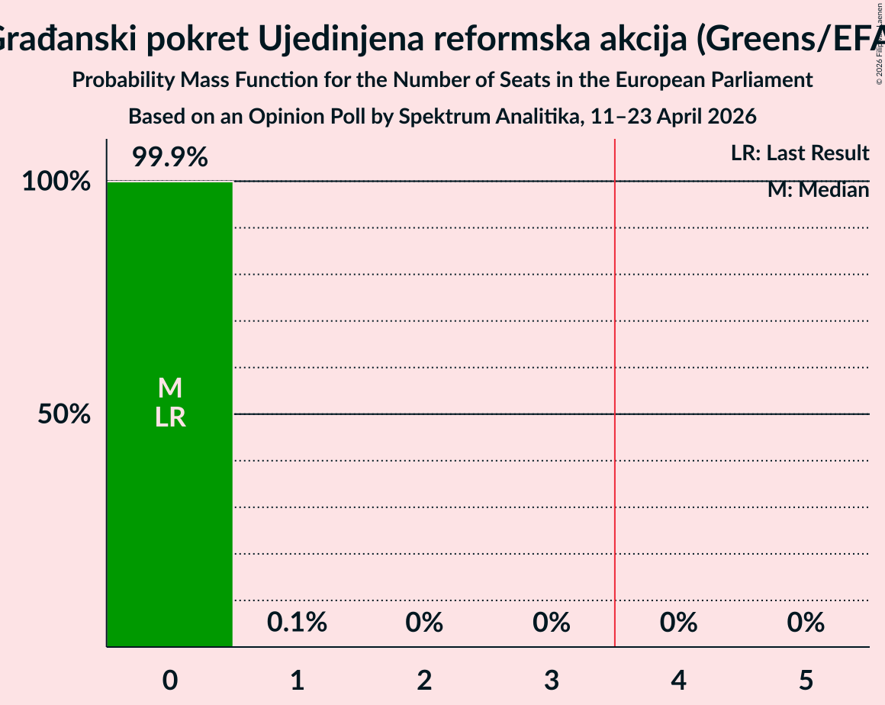

| Number of Seats | Probability | Accumulated | Special Marks |
|:---------------:|:-----------:|:-----------:|:-------------:|
| 0 | 100% | 100% | Last Result, Median |

### Evropski savez (S&D)

*For a full overview of the results for this party, see the [Evropski savez (S&D)](party-evropskisavezsd.html) page.*

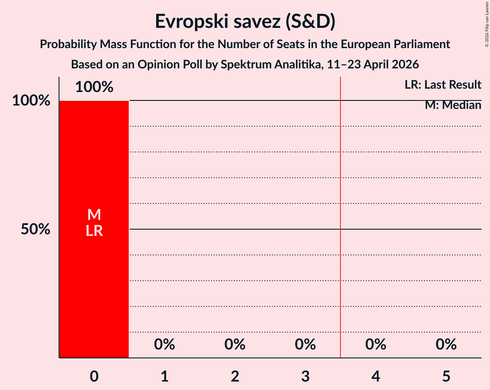

| Number of Seats | Probability | Accumulated | Special Marks |
|:---------------:|:-----------:|:-----------:|:-------------:|
| 0 | 100% | 100% | Last Result, Median |

### Покрет народног повјерења (*)

*For a full overview of the results for this party, see the [Покрет народног повјерења (*)](party-покретнародногповјерења.html) page.*

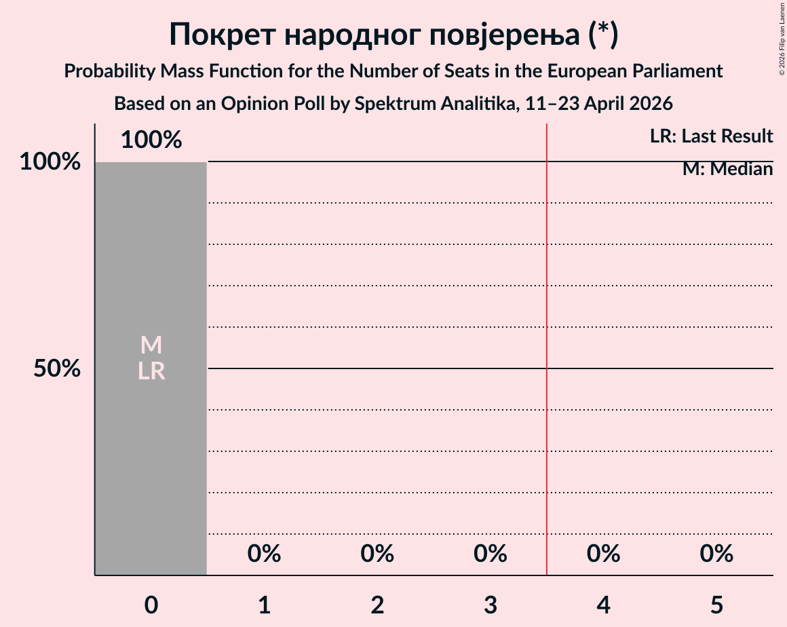

| Number of Seats | Probability | Accumulated | Special Marks |
|:---------------:|:-----------:|:-----------:|:-------------:|
| 0 | 100% | 100% | Last Result, Median |

### Социјалистичка народна партија Црне Горе (S&D)

*For a full overview of the results for this party, see the [Социјалистичка народна партија Црне Горе (S&D)](party-социјалистичканароднапартијацрнегореsd.html) page.*

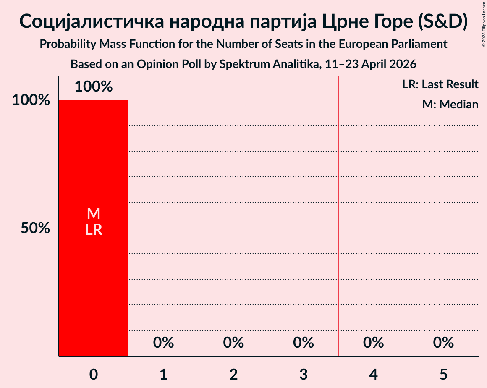

| Number of Seats | Probability | Accumulated | Special Marks |
|:---------------:|:-----------:|:-----------:|:-------------:|
| 0 | 100% | 100% | Last Result, Median |

### Alternativa Shqiptare (NI)

*For a full overview of the results for this party, see the [Alternativa Shqiptare (NI)](party-alternativashqiptareni.html) page.*

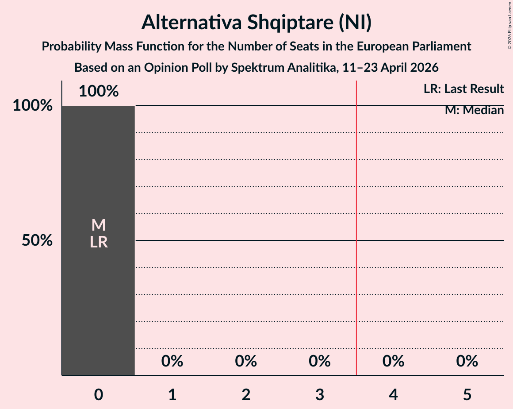

| Number of Seats | Probability | Accumulated | Special Marks |
|:---------------:|:-----------:|:-----------:|:-------------:|
| 0 | 100% | 100% | Last Result, Median |

### Pozitivna Crna Gora (*)

*For a full overview of the results for this party, see the [Pozitivna Crna Gora (*)](party-pozitivnacrnagora.html) page.*

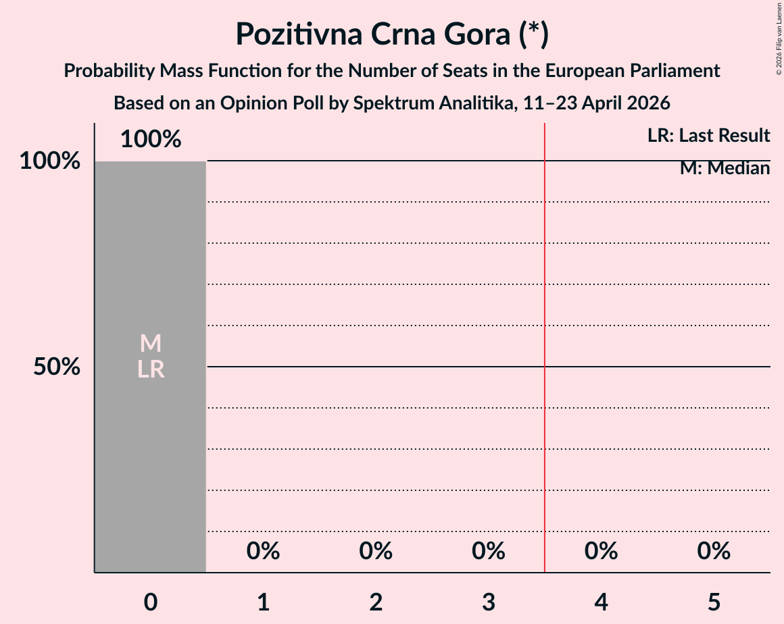

| Number of Seats | Probability | Accumulated | Special Marks |
|:---------------:|:-----------:|:-----------:|:-------------:|
| 0 | 100% | 100% | Last Result, Median |

### Preokret za sigurnu Crnu Goru (*)

*For a full overview of the results for this party, see the [Preokret za sigurnu Crnu Goru (*)](party-preokretzasigurnucrnugoru.html) page.*

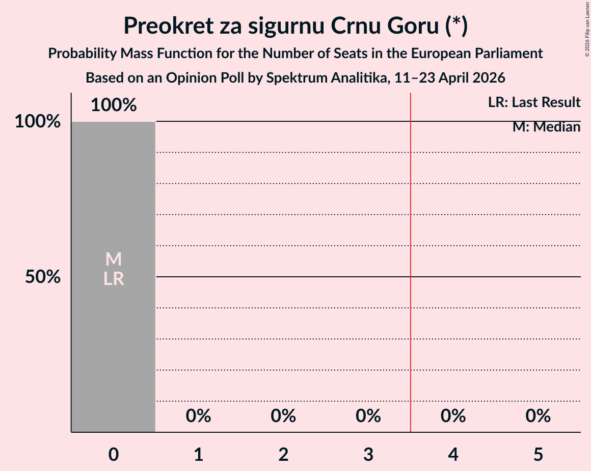

| Number of Seats | Probability | Accumulated | Special Marks |
|:---------------:|:-----------:|:-----------:|:-------------:|
| 0 | 100% | 100% | Last Result, Median |

### Forca e Re Demokratike (*)

*For a full overview of the results for this party, see the [Forca e Re Demokratike (*)](party-forcaeredemokratike.html) page.*

| Number of Seats | Probability | Accumulated | Special Marks |
|:---------------:|:-----------:|:-----------:|:-------------:|
| 0 | 100% | 100% | Last Result, Median |

### Unioni Demokratik i Shqiptarëve (*)

*For a full overview of the results for this party, see the [Unioni Demokratik i Shqiptarëve (*)](party-unionidemokratikishqiptarëve.html) page.*

| Number of Seats | Probability | Accumulated | Special Marks |
|:---------------:|:-----------:|:-----------:|:-------------:|
| 0 | 100% | 100% | Last Result, Median |

### Уједињена Црна Гора (*)

*For a full overview of the results for this party, see the [Уједињена Црна Гора (*)](party-уједињенацрнагора.html) page.*

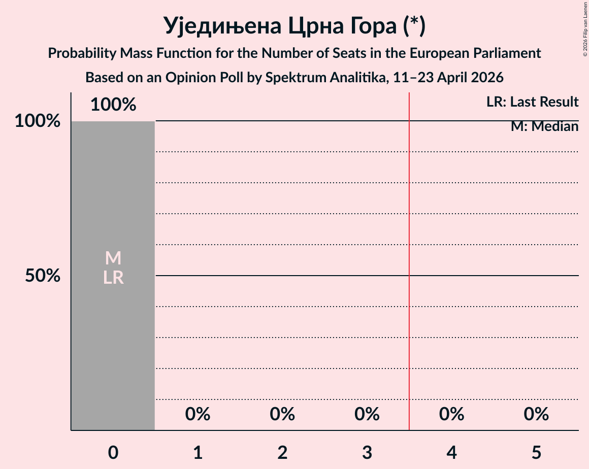

| Number of Seats | Probability | Accumulated | Special Marks |
|:---------------:|:-----------:|:-----------:|:-------------:|
| 0 | 100% | 100% | Last Result, Median |

## Coalitions

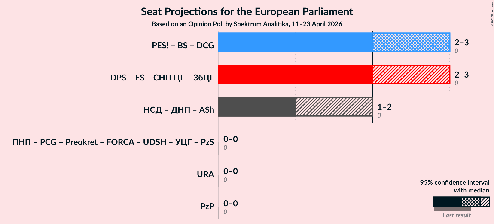

### Confidence Intervals

| Coalition | Last Result | Median | Majority? | 80% Confidence Interval | 90% Confidence Interval | 95% Confidence Interval | 99% Confidence Interval |
|:---------:|:-----------:|:------:|:---------:|:-----------------------:|:-----------------------:|:-----------------------:|:-----------------------:|
| Pokret Evropa sad (EPP) – Bošnjačka stranka (EPP) – Demokratska Crna Gora (EPP) | 0 | 3 | 0% | 2–3 | 2–3 | 2–3 | 2–3 |
| Нова српска демократија (NI) – Демократска народна партија (NI) – Alternativa Shqiptare (NI) | 0 | 1 | 0% | 1 | 1–2 | 1–2 | 1–2 |
| Građanski pokret Ujedinjena reformska akcija (Greens/EFA) | 0 | 0 | 0% | 0 | 0 | 0 | 0 |

### Pokret Evropa sad (EPP) – Bošnjačka stranka (EPP) – Demokratska Crna Gora (EPP)

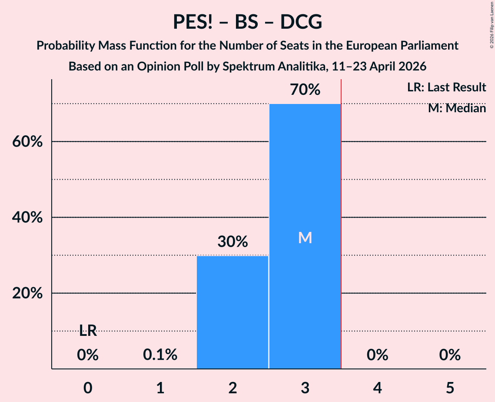

| Number of Seats | Probability | Accumulated | Special Marks |
|:---------------:|:-----------:|:-----------:|:-------------:|
| 0 | 0% | 100% | Last Result |
| 1 | 0% | 100% |  |
| 2 | 19% | 100% |  |
| 3 | 81% | 81% | Median |
| 4 | 0% | 0% | Majority |

### Нова српска демократија (NI) – Демократска народна партија (NI) – Alternativa Shqiptare (NI)

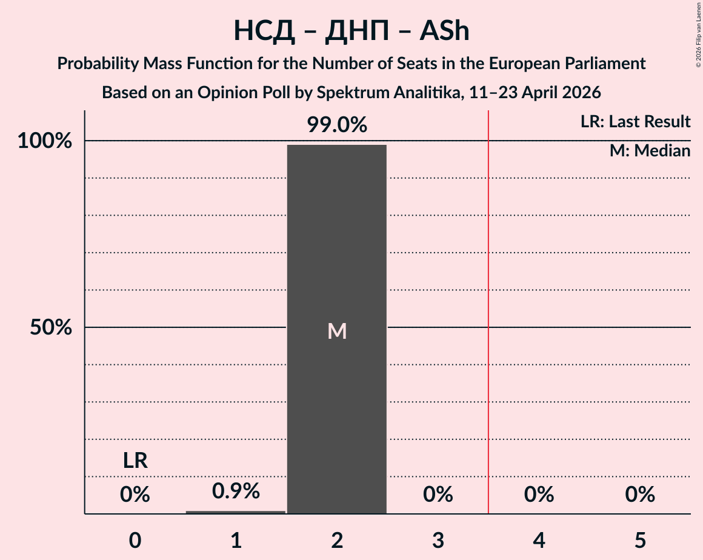

| Number of Seats | Probability | Accumulated | Special Marks |
|:---------------:|:-----------:|:-----------:|:-------------:|
| 0 | 0% | 100% | Last Result |
| 1 | 95% | 100% | Median |
| 2 | 5% | 5% |  |
| 3 | 0% | 0% |  |

### Građanski pokret Ujedinjena reformska akcija (Greens/EFA)

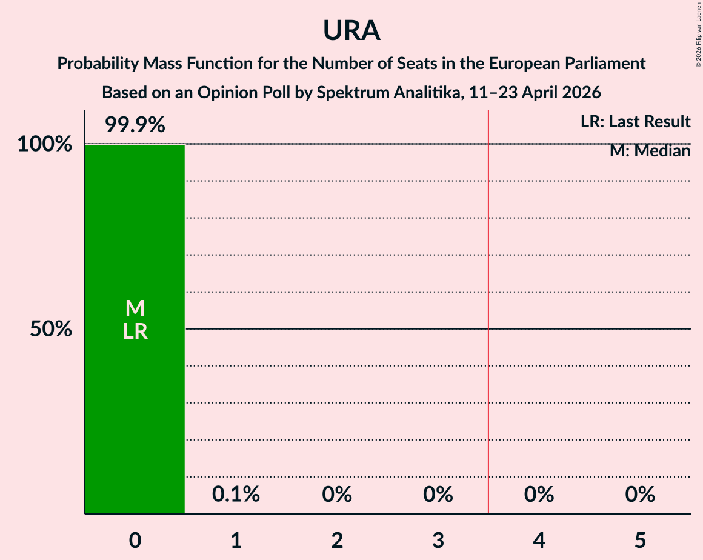

| Number of Seats | Probability | Accumulated | Special Marks |
|:---------------:|:-----------:|:-----------:|:-------------:|
| 0 | 100% | 100% | Last Result, Median |

## Technical Information

### Opinion Poll

+ **Polling firm:** Spektrum Analitika
+ **Commissioner(s):** —
+ **Fieldwork period:** 11–23 April 2026

### Calculations

+ **Sample size:** 615
+ **Simulations done:** 1,048,576
+ **Error estimate:** 2.35%

