# Poll Average

<a href="#voting-intentions">Voting Intentions</a> | <a href="#seats">Seats</a> | <a href="#coalitions">Coalitions</a> | <a href="#technical-information">Technical Information</a>

## Summary

The table below lists the polls on which the average is based. They are the most recent polls (less than 90 days old) registered and analyzed so far.

| Period     | Polling firm/Commissioner(s) | URA | DPS | ES | СНП ЦГ | BS | DCG | PES! | PzP | ASh | ДНП | НСД | FORCA | PCG | PzS | Preokret | UDSH | ПНП | УЦГ |
|:----------:|:----------------------------:|:--:|:--:|:--:|:--:|:--:|:--:|:--:|:--:|:--:|:--:|:--:|:--:|:--:|:--:|:--:|:--:|:--:|:--:|
| 9 June 2024 | General Election | 0.0%   0 | 0.0%   0 | 0.0%   0 | 0.0%   0 | 0.0%   0 | 0.0%   0 | 0.0%   0 | 0.0%   0 | 0.0%   0 | 0.0%   0 | 0.0%   0 | 0.0%   0 | 0.0%   0 | 0.0%   0 | 0.0%   0 | 0.0%   0 | 0.0%   0 | 0.0%   0 |
| N/A | Poll Average | 7–10%   0–1 | 20–25%   2–3 | 4–6%   0 | 1–3%   0 | 3–5%   0 | 4–6%   0 | 13–16%   1–2 | N/A   N/A | 1–2%   0 | 7–10%   0–1 | 8–11%   1 | N/A   N/A | N/A   N/A | N/A   N/A | 0–1%   0 | N/A   N/A | N/A   N/A | N/A   N/A |
| [1–10 August 2026](2026-08-10-EuroSearchAnalytic.html) | EuroSearchAnalytic | 7–10%   0–1 | 20–25%   2–3 | 4–6%   0 | 1–3%   0 | 3–5%   0 | 4–6%   0 | 13–16%   1–2 | N/A   N/A | 1–2%   0 | 7–10%   0–1 | 7–11%   1 | N/A   N/A | N/A   N/A | N/A   N/A | 0–1%   0 | N/A   N/A | N/A   N/A | N/A   N/A |
| 9 June 2024 | General Election | 0.0%   0 | 0.0%   0 | 0.0%   0 | 0.0%   0 | 0.0%   0 | 0.0%   0 | 0.0%   0 | 0.0%   0 | 0.0%   0 | 0.0%   0 | 0.0%   0 | 0.0%   0 | 0.0%   0 | 0.0%   0 | 0.0%   0 | 0.0%   0 | 0.0%   0 | 0.0%   0 |

Only polls for which at least the sample size has been published are included in the table above.

**Legend:**
+ **Top half of each row:** Voting intentions (95% confidence interval)
+ **Bottom half of each row:** Seat projections for the European Parliament (95% confidence interval)
+ **URA:** Građanski pokret Ujedinjena reformska akcija (Greens/EFA)
+ **DPS:** Demokratska partija socijalista Crne Gore (S&D)
+ **ES:** Evropski savez (S&D)
+ **СНП ЦГ:** Социјалистичка народна партија Црне Горе (S&D)
+ **BS:** Bošnjačka stranka (EPP)
+ **DCG:** Demokratska Crna Gora (EPP)
+ **PES!:** Pokret Evropa sad (EPP)
+ **PzP:** Pokret za promjene (ECR)
+ **ASh:** Alternativa Shqiptare (NI)
+ **ДНП:** Демократска народна партија (NI)
+ **НСД:** Нова српска демократија (NI)
+ **FORCA:** Forca e Re Demokratike (*)
+ **PCG:** Pozitivna Crna Gora (*)
+ **PzS:** Pravda za sve (*)
+ **Preokret:** Preokret za sigurnu Crnu Goru (*)
+ **UDSH:** Unioni Demokratik i Shqiptarëve (*)
+ **ПНП:** Покрет народног повјерења (*)
+ **УЦГ:** Уједињена Црна Гора (*)
+ **N/A (single party):** Party not included the published results
+ **N/A (entire row):** Calculation for this opinion poll not started yet

## Voting Intentions

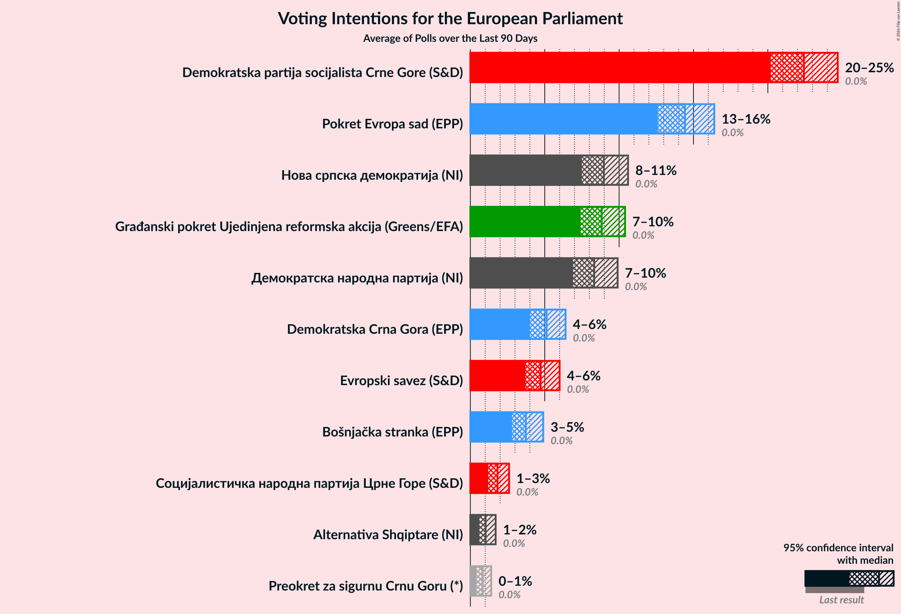

### Confidence Intervals

| Party | Last Result | Median | 80% Confidence Interval | 90% Confidence Interval | 95% Confidence Interval | 99% Confidence Interval |
|:-----:|:-----------:|:------:|:-----------------------:|:-----------------------:|:-----------------------:|:-----------------------:|
| <a href="#građanski-pokret-ujedinjena-reformska-akcija-(greens/efa)">Građanski pokret Ujedinjena reformska akcija (Greens/EFA)</a> | 0.0% | 8.8% | 7.8–9.9% |7.6–10.2% | 7.4–10.4% | 6.9–11.0% |
| <a href="#demokratska-partija-socijalista-crne-gore-(s&d)">Demokratska partija socijalista Crne Gore (S&D)</a> | 0.0% | 22.4% | 21.0–23.9% |20.6–24.3% | 20.2–24.7% | 19.5–25.5% |
| <a href="#evropski-savez-(s&d)">Evropski savez (S&D)</a> | 0.0% | 4.7% | 4.0–5.5% |3.8–5.8% | 3.7–6.0% | 3.4–6.4% |
| <a href="#социјалистичка-народна-партија-црне-горе-(s&d)">Социјалистичка народна партија Црне Горе (S&D)</a> | 0.0% | 1.8% | 1.4–2.3% |1.3–2.5% | 1.2–2.6% | 1.0–2.9% |
| <a href="#bošnjačka-stranka-(epp)">Bošnjačka stranka (EPP)</a> | 0.0% | 3.7% | 3.1–4.5% |2.9–4.7% | 2.8–4.9% | 2.5–5.3% |
| <a href="#demokratska-crna-gora-(epp)">Demokratska Crna Gora (EPP)</a> | 0.0% | 5.1% | 4.4–5.9% |4.2–6.2% | 4.0–6.4% | 3.7–6.9% |
| <a href="#pokret-evropa-sad-(epp)">Pokret Evropa sad (EPP)</a> | 0.0% | 14.4% | 13.2–15.7% |12.9–16.1% | 12.6–16.4% | 12.0–17.0% |
| <a href="#pokret-za-promjene-(ecr)">Pokret za promjene (ECR)</a> | 0.0% | N/A | N/A |N/A | N/A | N/A |
| <a href="#alternativa-shqiptare-(ni)">Alternativa Shqiptare (NI)</a> | 0.0% | 1.0% | 0.7–1.5% |0.6–1.6% | 0.6–1.7% | 0.5–1.9% |
| <a href="#демократска-народна-партија-(ni)">Демократска народна партија (NI)</a> | 0.0% | 8.3% | 7.4–9.4% |7.2–9.7% | 6.9–9.9% | 6.5–10.5% |
| <a href="#нова-српска-демократија-(ni)">Нова српска демократија (NI)</a> | 0.0% | 9.0% | 8.0–10.0% |7.7–10.3% | 7.5–10.6% | 7.1–11.1% |
| <a href="#forca-e-re-demokratike-(*)">Forca e Re Demokratike (*)</a> | 0.0% | N/A | N/A |N/A | N/A | N/A |
| <a href="#pozitivna-crna-gora-(*)">Pozitivna Crna Gora (*)</a> | 0.0% | N/A | N/A |N/A | N/A | N/A |
| <a href="#pravda-za-sve-(*)">Pravda za sve (*)</a> | 0.0% | N/A | N/A |N/A | N/A | N/A |
| <a href="#preokret-za-sigurnu-crnu-goru-(*)">Preokret za sigurnu Crnu Goru (*)</a> | 0.0% | 0.8% | 0.5–1.2% |0.5–1.3% | 0.4–1.4% | 0.3–1.6% |
| <a href="#unioni-demokratik-i-shqiptarëve-(*)">Unioni Demokratik i Shqiptarëve (*)</a> | 0.0% | N/A | N/A |N/A | N/A | N/A |
| <a href="#покрет-народног-повјерења-(*)">Покрет народног повјерења (*)</a> | 0.0% | N/A | N/A |N/A | N/A | N/A |
| <a href="#уједињена-црна-гора-(*)">Уједињена Црна Гора (*)</a> | 0.0% | N/A | N/A |N/A | N/A | N/A |

### Нова српска демократија (NI)

*For a full overview of the results for this party, see the [Нова српска демократија (NI)](party-новасрпскадемократијаni.html) page.*

| Voting Intentions | Probability | Accumulated | Special Marks |
|:-----------------:|:-----------:|:-----------:|:-------------:|
| 0.0–0.5% | 0% | 100% | Last Result |
| 0.5–1.5% | 0% | 100% |  |
| 1.5–2.5% | 0% | 100% |  |
| 2.5–3.5% | 0% | 100% |  |
| 3.5–4.5% | 0% | 100% |  |
| 4.5–5.5% | 0% | 100% |  |
| 5.5–6.5% | 0% | 100% |  |
| 6.5–7.5% | 3% | 100% |  |
| 7.5–8.5% | 27% | 97% |  |
| 8.5–9.5% | 47% | 70% | Median |
| 9.5–10.5% | 20% | 23% |  |
| 10.5–11.5% | 3% | 3% |  |
| 11.5–12.5% | 0.1% | 0.1% |  |
| 12.5–13.5% | 0% | 0% |  |

### Evropski savez (S&D)

*For a full overview of the results for this party, see the [Evropski savez (S&D)](party-evropskisavezsd.html) page.*

| Voting Intentions | Probability | Accumulated | Special Marks |
|:-----------------:|:-----------:|:-----------:|:-------------:|
| 0.0–0.5% | 0% | 100% | Last Result |
| 0.5–1.5% | 0% | 100% |  |
| 1.5–2.5% | 0% | 100% |  |
| 2.5–3.5% | 1.4% | 100% |  |
| 3.5–4.5% | 36% | 98.6% |  |
| 4.5–5.5% | 53% | 62% | Median |
| 5.5–6.5% | 9% | 10% |  |
| 6.5–7.5% | 0.3% | 0.3% |  |
| 7.5–8.5% | 0% | 0% |  |

### Демократска народна партија (NI)

*For a full overview of the results for this party, see the [Демократска народна партија (NI)](party-демократсканароднапартијаni.html) page.*

| Voting Intentions | Probability | Accumulated | Special Marks |
|:-----------------:|:-----------:|:-----------:|:-------------:|
| 0.0–0.5% | 0% | 100% | Last Result |
| 0.5–1.5% | 0% | 100% |  |
| 1.5–2.5% | 0% | 100% |  |
| 2.5–3.5% | 0% | 100% |  |
| 3.5–4.5% | 0% | 100% |  |
| 4.5–5.5% | 0% | 100% |  |
| 5.5–6.5% | 0.6% | 100% |  |
| 6.5–7.5% | 13% | 99.4% |  |
| 7.5–8.5% | 46% | 86% | Median |
| 8.5–9.5% | 33% | 40% |  |
| 9.5–10.5% | 6% | 7% |  |
| 10.5–11.5% | 0.4% | 0.4% |  |
| 11.5–12.5% | 0% | 0% |  |

### Pokret Evropa sad (EPP)

*For a full overview of the results for this party, see the [Pokret Evropa sad (EPP)](party-pokretevropasadepp.html) page.*

| Voting Intentions | Probability | Accumulated | Special Marks |
|:-----------------:|:-----------:|:-----------:|:-------------:|
| 0.0–0.5% | 0% | 100% | Last Result |
| 0.5–1.5% | 0% | 100% |  |
| 1.5–2.5% | 0% | 100% |  |
| 2.5–3.5% | 0% | 100% |  |
| 3.5–4.5% | 0% | 100% |  |
| 4.5–5.5% | 0% | 100% |  |
| 5.5–6.5% | 0% | 100% |  |
| 6.5–7.5% | 0% | 100% |  |
| 7.5–8.5% | 0% | 100% |  |
| 8.5–9.5% | 0% | 100% |  |
| 9.5–10.5% | 0% | 100% |  |
| 10.5–11.5% | 0.1% | 100% |  |
| 11.5–12.5% | 2% | 99.9% |  |
| 12.5–13.5% | 16% | 98% |  |
| 13.5–14.5% | 37% | 82% | Median |
| 14.5–15.5% | 32% | 44% |  |
| 15.5–16.5% | 11% | 13% |  |
| 16.5–17.5% | 2% | 2% |  |
| 17.5–18.5% | 0.1% | 0.1% |  |
| 18.5–19.5% | 0% | 0% |  |

### Preokret za sigurnu Crnu Goru (*)

*For a full overview of the results for this party, see the [Preokret za sigurnu Crnu Goru (*)](party-preokretzasigurnucrnugoru.html) page.*

| Voting Intentions | Probability | Accumulated | Special Marks |
|:-----------------:|:-----------:|:-----------:|:-------------:|
| 0.0–0.5% | 11% | 100% | Last Result |
| 0.5–1.5% | 88% | 89% | Median |
| 1.5–2.5% | 0.9% | 0.9% |  |
| 2.5–3.5% | 0% | 0% |  |

### Građanski pokret Ujedinjena reformska akcija (Greens/EFA)

*For a full overview of the results for this party, see the [Građanski pokret Ujedinjena reformska akcija (Greens/EFA)](party-građanskipokretujedinjenareformskaakcijagreensefa.html) page.*

| Voting Intentions | Probability | Accumulated | Special Marks |
|:-----------------:|:-----------:|:-----------:|:-------------:|
| 0.0–0.5% | 0% | 100% | Last Result |
| 0.5–1.5% | 0% | 100% |  |
| 1.5–2.5% | 0% | 100% |  |
| 2.5–3.5% | 0% | 100% |  |
| 3.5–4.5% | 0% | 100% |  |
| 4.5–5.5% | 0% | 100% |  |
| 5.5–6.5% | 0.1% | 100% |  |
| 6.5–7.5% | 4% | 99.9% |  |
| 7.5–8.5% | 32% | 95% |  |
| 8.5–9.5% | 45% | 63% | Median |
| 9.5–10.5% | 16% | 18% |  |
| 10.5–11.5% | 2% | 2% |  |
| 11.5–12.5% | 0.1% | 0.1% |  |
| 12.5–13.5% | 0% | 0% |  |

### Bošnjačka stranka (EPP)

*For a full overview of the results for this party, see the [Bošnjačka stranka (EPP)](party-bošnjačkastrankaepp.html) page.*

| Voting Intentions | Probability | Accumulated | Special Marks |
|:-----------------:|:-----------:|:-----------:|:-------------:|
| 0.0–0.5% | 0% | 100% | Last Result |
| 0.5–1.5% | 0% | 100% |  |
| 1.5–2.5% | 0.5% | 100% |  |
| 2.5–3.5% | 35% | 99.5% |  |
| 3.5–4.5% | 57% | 64% | Median |
| 4.5–5.5% | 7% | 7% |  |
| 5.5–6.5% | 0.1% | 0.1% |  |
| 6.5–7.5% | 0% | 0% |  |

### Alternativa Shqiptare (NI)

*For a full overview of the results for this party, see the [Alternativa Shqiptare (NI)](party-alternativashqiptareni.html) page.*

| Voting Intentions | Probability | Accumulated | Special Marks |
|:-----------------:|:-----------:|:-----------:|:-------------:|
| 0.0–0.5% | 1.4% | 100% | Last Result |
| 0.5–1.5% | 93% | 98.6% | Median |
| 1.5–2.5% | 6% | 6% |  |
| 2.5–3.5% | 0% | 0% |  |

### Социјалистичка народна партија Црне Горе (S&D)

*For a full overview of the results for this party, see the [Социјалистичка народна партија Црне Горе (S&D)](party-социјалистичканароднапартијацрнегореsd.html) page.*

| Voting Intentions | Probability | Accumulated | Special Marks |
|:-----------------:|:-----------:|:-----------:|:-------------:|
| 0.0–0.5% | 0% | 100% | Last Result |
| 0.5–1.5% | 23% | 100% |  |
| 1.5–2.5% | 73% | 77% | Median |
| 2.5–3.5% | 4% | 4% |  |
| 3.5–4.5% | 0% | 0% |  |

### Demokratska partija socijalista Crne Gore (S&D)

*For a full overview of the results for this party, see the [Demokratska partija socijalista Crne Gore (S&D)](party-demokratskapartijasocijalistacrnegoresd.html) page.*

| Voting Intentions | Probability | Accumulated | Special Marks |
|:-----------------:|:-----------:|:-----------:|:-------------:|
| 0.0–0.5% | 0% | 100% | Last Result |
| 0.5–1.5% | 0% | 100% |  |
| 1.5–2.5% | 0% | 100% |  |
| 2.5–3.5% | 0% | 100% |  |
| 3.5–4.5% | 0% | 100% |  |
| 4.5–5.5% | 0% | 100% |  |
| 5.5–6.5% | 0% | 100% |  |
| 6.5–7.5% | 0% | 100% |  |
| 7.5–8.5% | 0% | 100% |  |
| 8.5–9.5% | 0% | 100% |  |
| 9.5–10.5% | 0% | 100% |  |
| 10.5–11.5% | 0% | 100% |  |
| 11.5–12.5% | 0% | 100% |  |
| 12.5–13.5% | 0% | 100% |  |
| 13.5–14.5% | 0% | 100% |  |
| 14.5–15.5% | 0% | 100% |  |
| 15.5–16.5% | 0% | 100% |  |
| 16.5–17.5% | 0% | 100% |  |
| 17.5–18.5% | 0% | 100% |  |
| 18.5–19.5% | 0.5% | 100% |  |
| 19.5–20.5% | 4% | 99.5% |  |
| 20.5–21.5% | 18% | 95% |  |
| 21.5–22.5% | 32% | 77% | Median |
| 22.5–23.5% | 29% | 46% |  |
| 23.5–24.5% | 13% | 17% |  |
| 24.5–25.5% | 3% | 3% |  |
| 25.5–26.5% | 0.4% | 0.4% |  |
| 26.5–27.5% | 0% | 0% |  |

### Demokratska Crna Gora (EPP)

*For a full overview of the results for this party, see the [Demokratska Crna Gora (EPP)](party-demokratskacrnagoraepp.html) page.*

| Voting Intentions | Probability | Accumulated | Special Marks |
|:-----------------:|:-----------:|:-----------:|:-------------:|
| 0.0–0.5% | 0% | 100% | Last Result |
| 0.5–1.5% | 0% | 100% |  |
| 1.5–2.5% | 0% | 100% |  |
| 2.5–3.5% | 0.2% | 100% |  |
| 3.5–4.5% | 17% | 99.8% |  |
| 4.5–5.5% | 58% | 83% | Median |
| 5.5–6.5% | 23% | 25% |  |
| 6.5–7.5% | 1.5% | 2% |  |
| 7.5–8.5% | 0% | 0% |  |

## Seats

### Confidence Intervals

| Party | Last Result | Median | 80% Confidence Interval | 90% Confidence Interval | 95% Confidence Interval | 99% Confidence Interval |
|:-----:|:-----------:|:------:|:-----------------------:|:-----------------------:|:-----------------------:|:-----------------------:|
| <a href="#građanski-pokret-ujedinjena-reformska-akcija-(greens/efa)">Građanski pokret Ujedinjena reformska akcija (Greens/EFA)</a> | 0 | 1 | 0–1 |0–1 | 0–1 | 0–1 |
| <a href="#demokratska-partija-socijalista-crne-gore-(s&d)">Demokratska partija socijalista Crne Gore (S&D)</a> | 0 | 2 | 2–3 |2–3 | 2–3 | 2–3 |
| <a href="#evropski-savez-(s&d)">Evropski savez (S&D)</a> | 0 | 0 | 0 |0 | 0 | 0 |
| <a href="#социјалистичка-народна-партија-црне-горе-(s&d)">Социјалистичка народна партија Црне Горе (S&D)</a> | 0 | 0 | 0 |0 | 0 | 0 |
| <a href="#bošnjačka-stranka-(epp)">Bošnjačka stranka (EPP)</a> | 0 | 0 | 0 |0 | 0 | 0 |
| <a href="#demokratska-crna-gora-(epp)">Demokratska Crna Gora (EPP)</a> | 0 | 0 | 0 |0 | 0 | 0 |
| <a href="#pokret-evropa-sad-(epp)">Pokret Evropa sad (EPP)</a> | 0 | 1 | 1 |1–2 | 1–2 | 1–2 |
| <a href="#pokret-za-promjene-(ecr)">Pokret za promjene (ECR)</a> | 0 | N/A | N/A |N/A | N/A | N/A |
| <a href="#alternativa-shqiptare-(ni)">Alternativa Shqiptare (NI)</a> | 0 | 0 | 0 |0 | 0 | 0 |
| <a href="#демократска-народна-партија-(ni)">Демократска народна партија (NI)</a> | 0 | 1 | 1 |1 | 0–1 | 0–1 |
| <a href="#нова-српска-демократија-(ni)">Нова српска демократија (NI)</a> | 0 | 1 | 1 |1 | 1 | 0–1 |
| <a href="#forca-e-re-demokratike-(*)">Forca e Re Demokratike (*)</a> | 0 | N/A | N/A |N/A | N/A | N/A |
| <a href="#pozitivna-crna-gora-(*)">Pozitivna Crna Gora (*)</a> | 0 | N/A | N/A |N/A | N/A | N/A |
| <a href="#pravda-za-sve-(*)">Pravda za sve (*)</a> | 0 | N/A | N/A |N/A | N/A | N/A |
| <a href="#preokret-za-sigurnu-crnu-goru-(*)">Preokret za sigurnu Crnu Goru (*)</a> | 0 | 0 | 0 |0 | 0 | 0 |
| <a href="#unioni-demokratik-i-shqiptarëve-(*)">Unioni Demokratik i Shqiptarëve (*)</a> | 0 | N/A | N/A |N/A | N/A | N/A |
| <a href="#покрет-народног-повјерења-(*)">Покрет народног повјерења (*)</a> | 0 | N/A | N/A |N/A | N/A | N/A |
| <a href="#уједињена-црна-гора-(*)">Уједињена Црна Гора (*)</a> | 0 | N/A | N/A |N/A | N/A | N/A |

### Građanski pokret Ujedinjena reformska akcija (Greens/EFA)

*For a full overview of the results for this party, see the [Građanski pokret Ujedinjena reformska akcija (Greens/EFA)](party-građanskipokretujedinjenareformskaakcijagreensefa.html) page.*

| Number of Seats | Probability | Accumulated | Special Marks |
|:---------------:|:-----------:|:-----------:|:-------------:|
| 0 | 12% | 100% | Last Result |
| 1 | 88% | 88% | Median |
| 2 | 0% | 0% |  |

### Demokratska partija socijalista Crne Gore (S&D)

*For a full overview of the results for this party, see the [Demokratska partija socijalista Crne Gore (S&D)](party-demokratskapartijasocijalistacrnegoresd.html) page.*

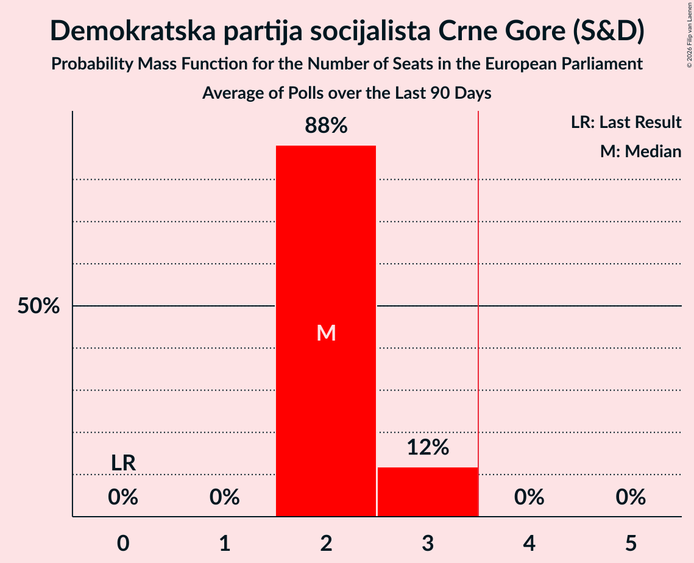

| Number of Seats | Probability | Accumulated | Special Marks |
|:---------------:|:-----------:|:-----------:|:-------------:|
| 0 | 0% | 100% | Last Result |
| 1 | 0% | 100% |  |
| 2 | 88% | 100% | Median |
| 3 | 12% | 12% |  |
| 4 | 0% | 0% | Majority |

### Evropski savez (S&D)

*For a full overview of the results for this party, see the [Evropski savez (S&D)](party-evropskisavezsd.html) page.*

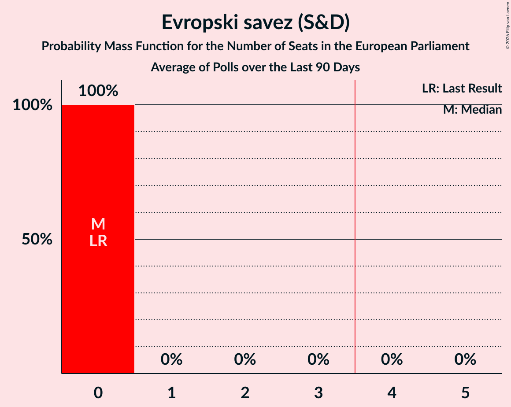

| Number of Seats | Probability | Accumulated | Special Marks |
|:---------------:|:-----------:|:-----------:|:-------------:|
| 0 | 100% | 100% | Last Result, Median |

### Социјалистичка народна партија Црне Горе (S&D)

*For a full overview of the results for this party, see the [Социјалистичка народна партија Црне Горе (S&D)](party-социјалистичканароднапартијацрнегореsd.html) page.*

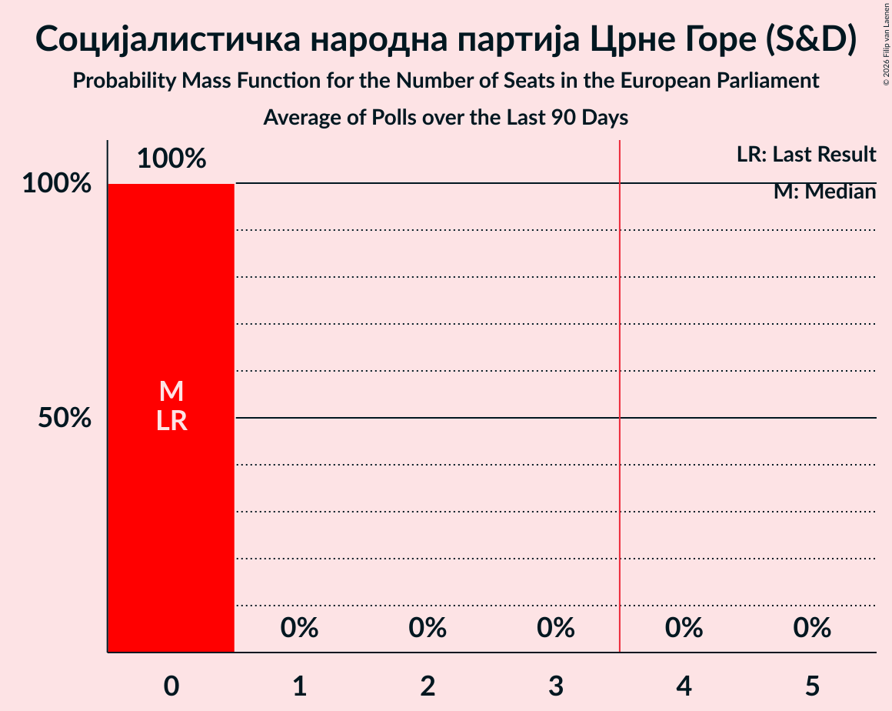

| Number of Seats | Probability | Accumulated | Special Marks |
|:---------------:|:-----------:|:-----------:|:-------------:|
| 0 | 100% | 100% | Last Result, Median |

### Bošnjačka stranka (EPP)

*For a full overview of the results for this party, see the [Bošnjačka stranka (EPP)](party-bošnjačkastrankaepp.html) page.*

| Number of Seats | Probability | Accumulated | Special Marks |
|:---------------:|:-----------:|:-----------:|:-------------:|
| 0 | 100% | 100% | Last Result, Median |

### Demokratska Crna Gora (EPP)

*For a full overview of the results for this party, see the [Demokratska Crna Gora (EPP)](party-demokratskacrnagoraepp.html) page.*

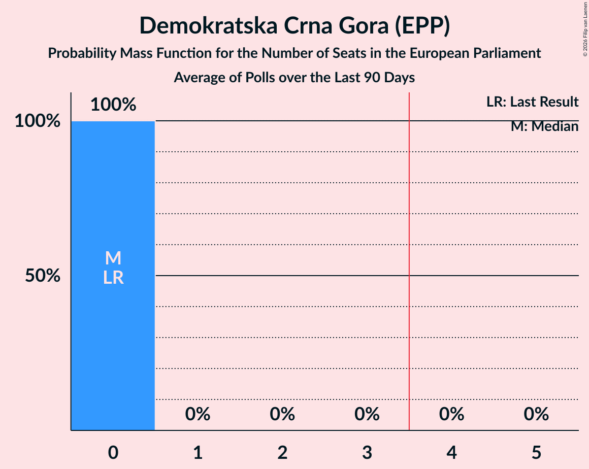

| Number of Seats | Probability | Accumulated | Special Marks |
|:---------------:|:-----------:|:-----------:|:-------------:|
| 0 | 100% | 100% | Last Result, Median |

### Pokret Evropa sad (EPP)

*For a full overview of the results for this party, see the [Pokret Evropa sad (EPP)](party-pokretevropasadepp.html) page.*

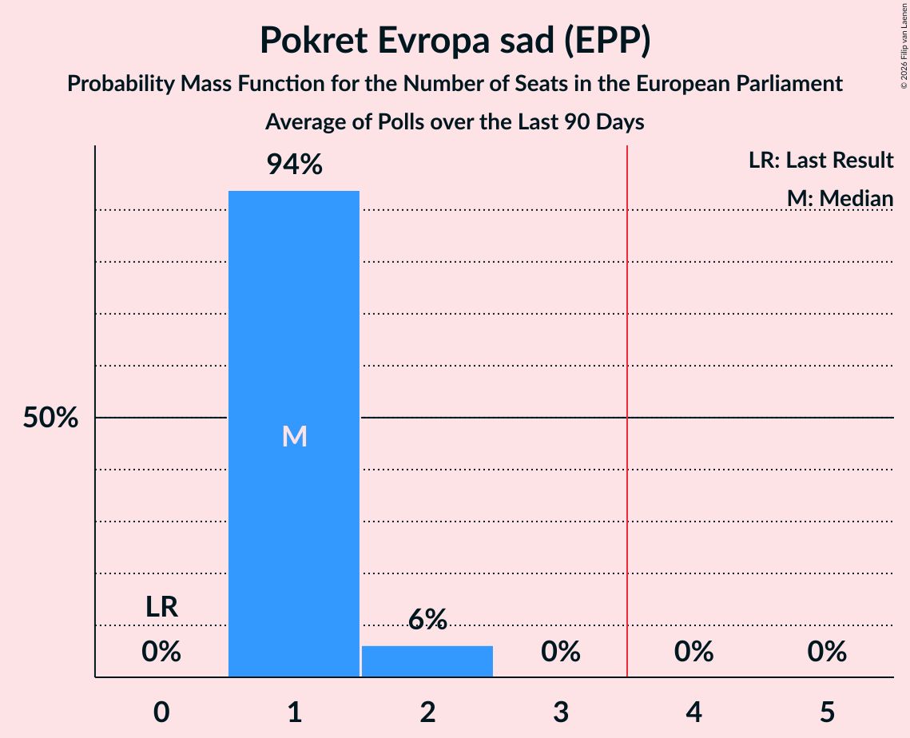

| Number of Seats | Probability | Accumulated | Special Marks |
|:---------------:|:-----------:|:-----------:|:-------------:|
| 0 | 0% | 100% | Last Result |
| 1 | 94% | 100% | Median |
| 2 | 6% | 6% |  |
| 3 | 0% | 0% |  |

### Pokret za promjene (ECR)

*For a full overview of the results for this party, see the [Pokret za promjene (ECR)](party-pokretzapromjeneecr.html) page.*

### Alternativa Shqiptare (NI)

*For a full overview of the results for this party, see the [Alternativa Shqiptare (NI)](party-alternativashqiptareni.html) page.*

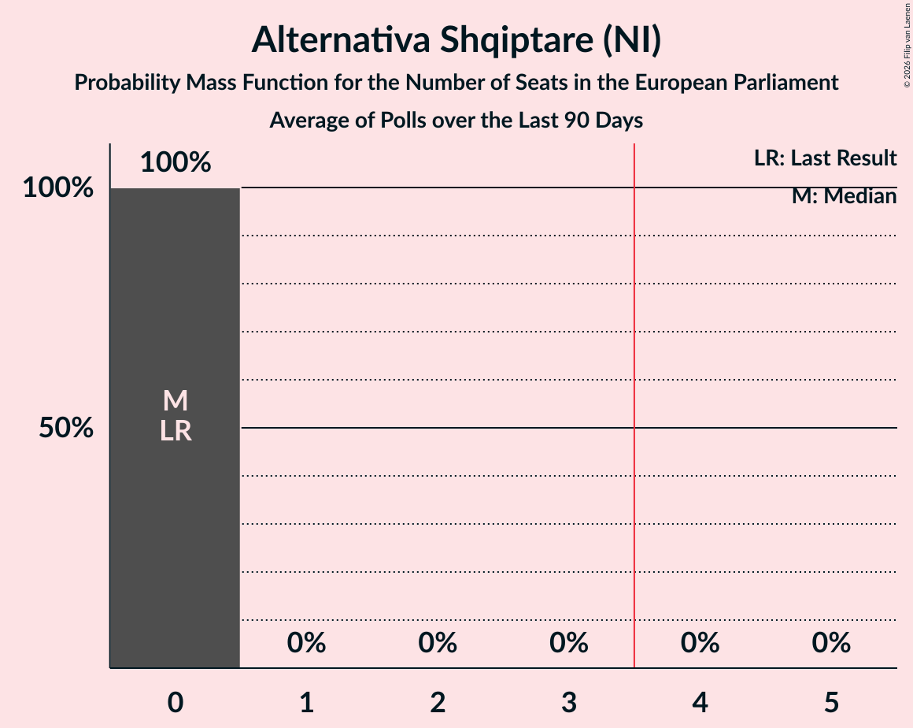

| Number of Seats | Probability | Accumulated | Special Marks |
|:---------------:|:-----------:|:-----------:|:-------------:|
| 0 | 100% | 100% | Last Result, Median |

### Демократска народна партија (NI)

*For a full overview of the results for this party, see the [Демократска народна партија (NI)](party-демократсканароднапартијаni.html) page.*

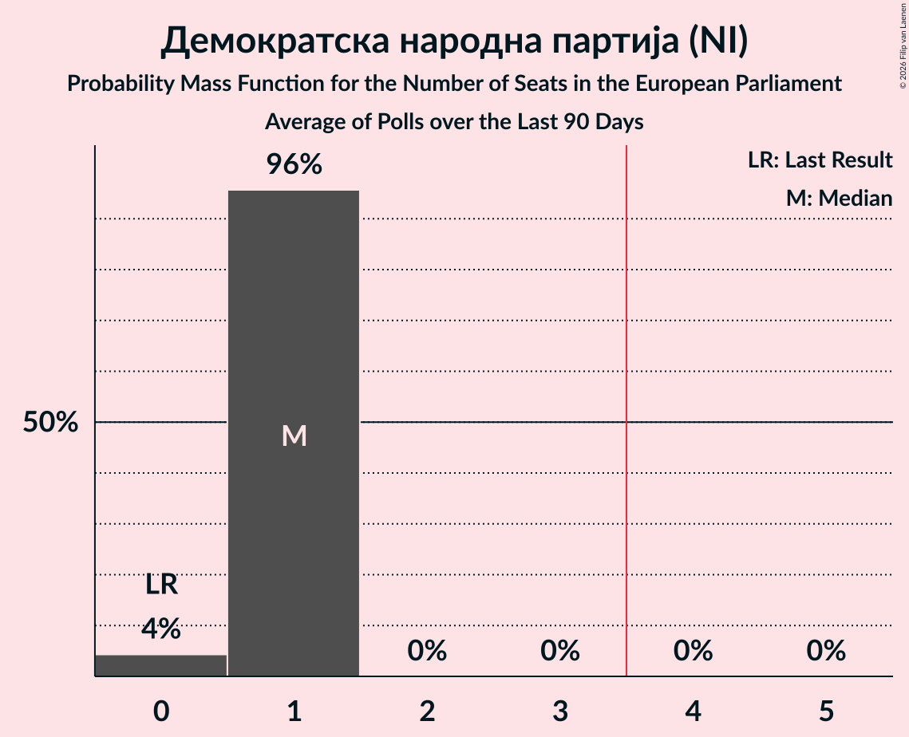

| Number of Seats | Probability | Accumulated | Special Marks |
|:---------------:|:-----------:|:-----------:|:-------------:|
| 0 | 4% | 100% | Last Result |
| 1 | 96% | 96% | Median |
| 2 | 0% | 0% |  |

### Нова српска демократија (NI)

*For a full overview of the results for this party, see the [Нова српска демократија (NI)](party-новасрпскадемократијаni.html) page.*

| Number of Seats | Probability | Accumulated | Special Marks |
|:---------------:|:-----------:|:-----------:|:-------------:|
| 0 | 2% | 100% | Last Result |
| 1 | 98% | 98% | Median |
| 2 | 0% | 0% |  |

### Forca e Re Demokratike (*)

*For a full overview of the results for this party, see the [Forca e Re Demokratike (*)](party-forcaeredemokratike.html) page.*

### Pozitivna Crna Gora (*)

*For a full overview of the results for this party, see the [Pozitivna Crna Gora (*)](party-pozitivnacrnagora.html) page.*

### Pravda za sve (*)

*For a full overview of the results for this party, see the [Pravda za sve (*)](party-pravdazasve.html) page.*

### Preokret za sigurnu Crnu Goru (*)

*For a full overview of the results for this party, see the [Preokret za sigurnu Crnu Goru (*)](party-preokretzasigurnucrnugoru.html) page.*

| Number of Seats | Probability | Accumulated | Special Marks |
|:---------------:|:-----------:|:-----------:|:-------------:|
| 0 | 100% | 100% | Last Result, Median |

### Unioni Demokratik i Shqiptarëve (*)

*For a full overview of the results for this party, see the [Unioni Demokratik i Shqiptarëve (*)](party-unionidemokratikishqiptarëve.html) page.*

### Покрет народног повјерења (*)

*For a full overview of the results for this party, see the [Покрет народног повјерења (*)](party-покретнародногповјерења.html) page.*

### Уједињена Црна Гора (*)

*For a full overview of the results for this party, see the [Уједињена Црна Гора (*)](party-уједињенацрнагора.html) page.*

## Coalitions

### Confidence Intervals

| Coalition | Last Result | Median | Majority? | 80% Confidence Interval | 90% Confidence Interval | 95% Confidence Interval | 99% Confidence Interval |
|:---------:|:-----------:|:------:|:---------:|:-----------------------:|:-----------------------:|:-----------------------:|:-----------------------:|
| Demokratska partija socijalista Crne Gore (S&D) – Evropski savez (S&D) – Социјалистичка народна партија Црне Горе (S&D) | 0 | 2 | 0% | 2–3 | 2–3 | 2–3 | 2–3 |
| Alternativa Shqiptare (NI) – Демократска народна партија (NI) – Нова српска демократија (NI) | 0 | 2 | 0% | 2 | 1–2 | 1–2 | 1–2 |
| Bošnjačka stranka (EPP) – Demokratska Crna Gora (EPP) – Pokret Evropa sad (EPP) | 0 | 1 | 0% | 1 | 1–2 | 1–2 | 1–2 |
| Građanski pokret Ujedinjena reformska akcija (Greens/EFA) | 0 | 1 | 0% | 0–1 | 0–1 | 0–1 | 0–1 |
| Forca e Re Demokratike (*) – Pozitivna Crna Gora (*) – Pravda za sve (*) – Preokret za sigurnu Crnu Goru (*) – Unioni Demokratik i Shqiptarëve (*) – Покрет народног повјерења (*) – Уједињена Црна Гора (*) | 0 | 0 | 0% | 0 | 0 | 0 | 0 |
| Pokret za promjene (ECR) | 0 | 0 | 0% | 0 | 0 | 0 | 0 |

### Demokratska partija socijalista Crne Gore (S&D) – Evropski savez (S&D) – Социјалистичка народна партија Црне Горе (S&D)

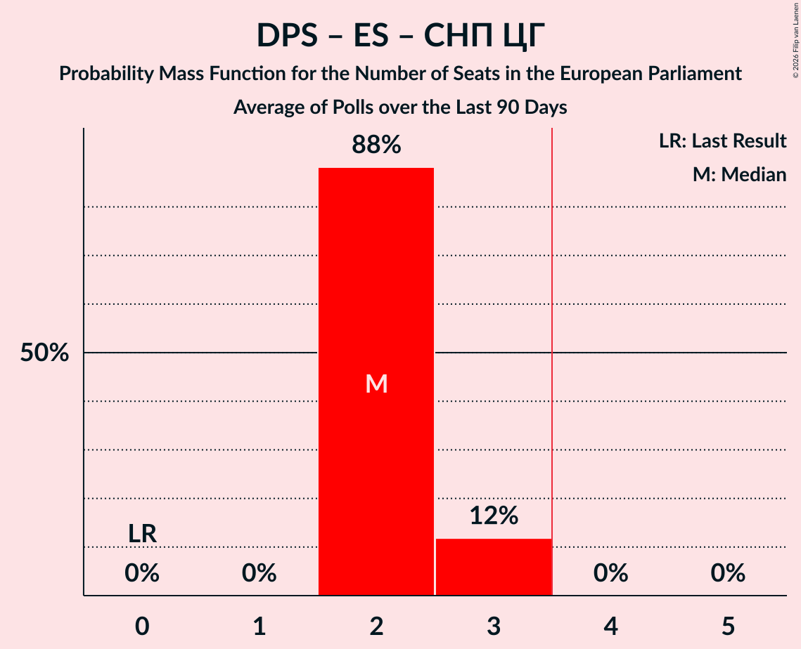

| Number of Seats | Probability | Accumulated | Special Marks |
|:---------------:|:-----------:|:-----------:|:-------------:|
| 0 | 0% | 100% | Last Result |
| 1 | 0% | 100% |  |
| 2 | 88% | 100% | Median |
| 3 | 12% | 12% |  |
| 4 | 0% | 0% | Majority |

### Alternativa Shqiptare (NI) – Демократска народна партија (NI) – Нова српска демократија (NI)

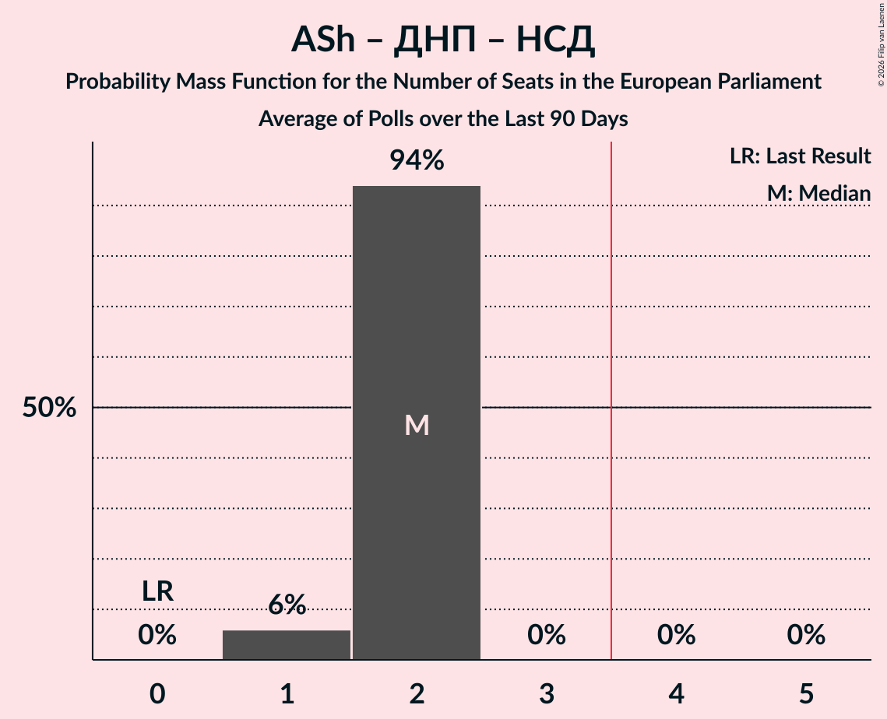

| Number of Seats | Probability | Accumulated | Special Marks |
|:---------------:|:-----------:|:-----------:|:-------------:|
| 0 | 0% | 100% | Last Result |
| 1 | 6% | 100% |  |
| 2 | 94% | 94% | Median |
| 3 | 0% | 0% |  |

### Bošnjačka stranka (EPP) – Demokratska Crna Gora (EPP) – Pokret Evropa sad (EPP)

| Number of Seats | Probability | Accumulated | Special Marks |
|:---------------:|:-----------:|:-----------:|:-------------:|
| 0 | 0% | 100% | Last Result |
| 1 | 94% | 100% | Median |
| 2 | 6% | 6% |  |
| 3 | 0% | 0% |  |

### Građanski pokret Ujedinjena reformska akcija (Greens/EFA)

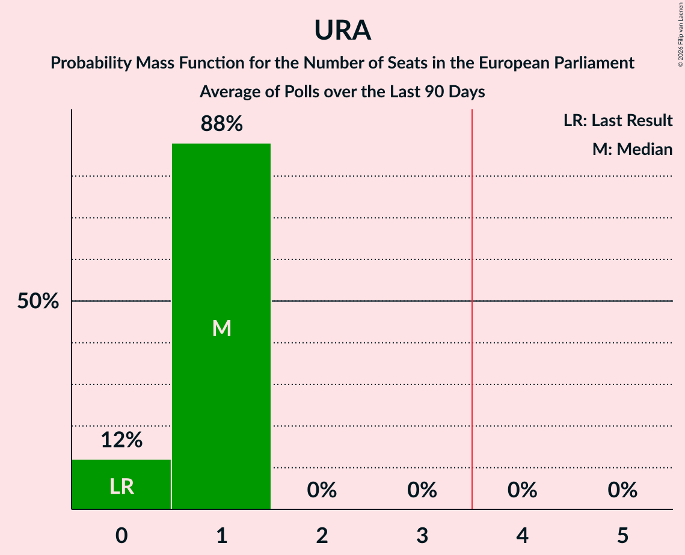

| Number of Seats | Probability | Accumulated | Special Marks |
|:---------------:|:-----------:|:-----------:|:-------------:|
| 0 | 12% | 100% | Last Result |
| 1 | 88% | 88% | Median |
| 2 | 0% | 0% |  |

### Forca e Re Demokratike (*) – Pozitivna Crna Gora (*) – Pravda za sve (*) – Preokret za sigurnu Crnu Goru (*) – Unioni Demokratik i Shqiptarëve (*) – Покрет народног повјерења (*) – Уједињена Црна Гора (*)

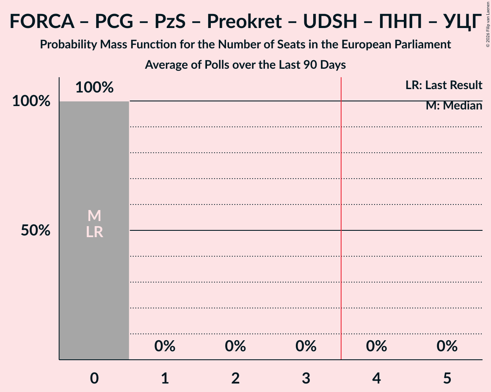

| Number of Seats | Probability | Accumulated | Special Marks |
|:---------------:|:-----------:|:-----------:|:-------------:|
| 0 | 100% | 100% | Last Result, Median |

### Pokret za promjene (ECR)

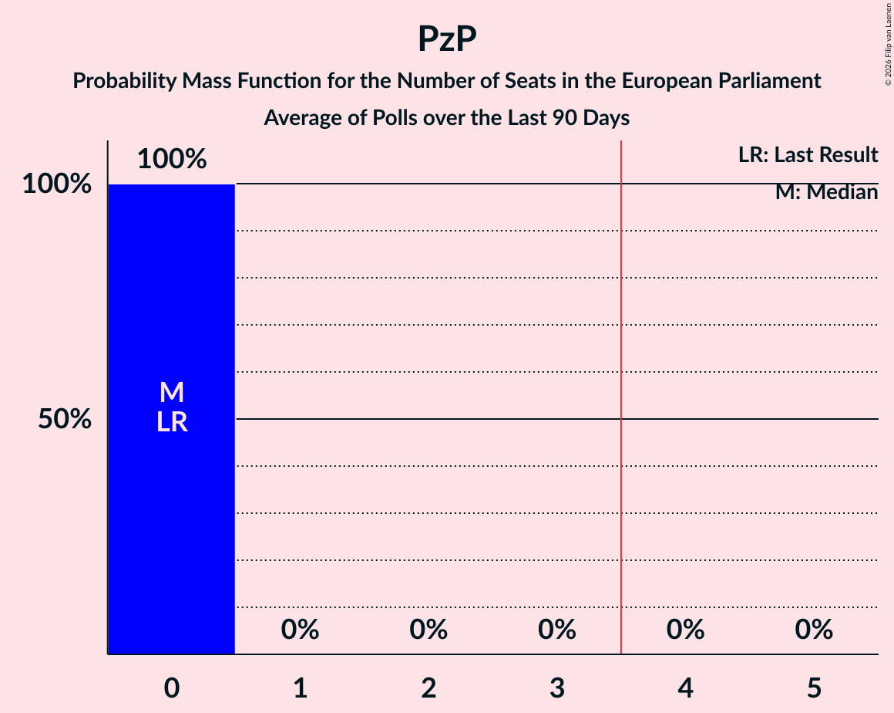

| Number of Seats | Probability | Accumulated | Special Marks |
|:---------------:|:-----------:|:-----------:|:-------------:|
| 0 | 100% | 100% | Last Result, Median |

## Technical Information

+ **Number of polls included in this average:** 1
+ **Lowest number of simulations done in a poll included in this average:** 2,097,152
+ **Total number of simulations done in the polls included in this average:** 2,097,152
+ **Error estimate:** 1.40%
