# Poll Average

<a href="#voting-intentions">Voting Intentions</a> | <a href="#seats">Seats</a> | <a href="#coalitions">Coalitions</a> | <a href="#technical-information">Technical Information</a>

## Summary

The table below lists the polls on which the average is based. They are the most recent polls (less than 90 days old) registered and analyzed so far.

| Period     | Polling firm/Commissioner(s) | URA | DPS | ES | СНП ЦГ | BS | DCG | PES! | PzP | ASh | ДНП | НСД | FORCA | PCG | PzS | Preokret | UDSH | ПНП | УЦГ |
|:----------:|:----------------------------:|:--:|:--:|:--:|:--:|:--:|:--:|:--:|:--:|:--:|:--:|:--:|:--:|:--:|:--:|:--:|:--:|:--:|:--:|
| 9 June 2024 | General Election | 0.0%   0 | 0.0%   0 | 0.0%   0 | 0.0%   0 | 0.0%   0 | 0.0%   0 | 0.0%   0 | 0.0%   0 | 0.0%   0 | 0.0%   0 | 0.0%   0 | 0.0%   0 | 0.0%   0 | 0.0%   0 | 0.0%   0 | 0.0%   0 | 0.0%   0 | 0.0%   0 |
| N/A | Poll Average | 4–9%   0–1 | 20–29%   2–3 | 3–7%   0 | 1–3%   0 | 3–8%   0–1 | 5–8%   0 | 13–23%   1–2 | N/A   N/A | 1–2%   0 | 6–10%   0–1 | 9–18%   1–2 | 0–1%   0 | 0–2%   0 | N/A   N/A | 0–2%   0 | 0–1%   0 | 1–3%   0 | 0–1%   0 |
| [11–23 April 2026](2026-04-23-SpektrumAnalitika.html) | Spektrum Analitika | 4–7%   0 | 23–30%   2–3 | 3–7%   0 | 1–3%   0 | 5–9%   0–1 | 5–9%   0 | 17–24%   1–2 | N/A   N/A | 1–2%   0 | 6–10%   0–1 | 13–18%   1–2 | 0–1%   0 | 0–2%   0 | N/A   N/A | 0–1%   0 | 0–1%   0 | 1–3%   0 | 0–1%   0 |
| [1–28 February 2026](2026-02-28-Datapraxis.html) | Datapraxis | 6–9%   0–1 | 20–24%   2–3 | 4–7%   0 | 1–3%   0 | 3–5%   0 | 5–7%   0 | 13–17%   1–2 | N/A   N/A | N/A   N/A | 6–8%   0–1 | 9–12%   1 | N/A   N/A | N/A   N/A | N/A   N/A | 1–2%   0 | N/A   N/A | N/A   N/A | N/A   N/A |
| 9 June 2024 | General Election | 0.0%   0 | 0.0%   0 | 0.0%   0 | 0.0%   0 | 0.0%   0 | 0.0%   0 | 0.0%   0 | 0.0%   0 | 0.0%   0 | 0.0%   0 | 0.0%   0 | 0.0%   0 | 0.0%   0 | 0.0%   0 | 0.0%   0 | 0.0%   0 | 0.0%   0 | 0.0%   0 |

Only polls for which at least the sample size has been published are included in the table above.

**Legend:**
+ **Top half of each row:** Voting intentions (95% confidence interval)
+ **Bottom half of each row:** Seat projections for the European Parliament (95% confidence interval)
+ **URA:** Građanski pokret Ujedinjena reformska akcija (Greens/EFA)
+ **DPS:** Demokratska partija socijalista Crne Gore (S&D)
+ **ES:** Evropski savez (S&D)
+ **СНП ЦГ:** Социјалистичка народна партија Црне Горе (S&D)
+ **BS:** Bošnjačka stranka (EPP)
+ **DCG:** Demokratska Crna Gora (EPP)
+ **PES!:** Pokret Evropa sad (EPP)
+ **PzP:** Pokret za promjene (ECR)
+ **ASh:** Alternativa Shqiptare (NI)
+ **ДНП:** Демократска народна партија (NI)
+ **НСД:** Нова српска демократија (NI)
+ **FORCA:** Forca e Re Demokratike (*)
+ **PCG:** Pozitivna Crna Gora (*)
+ **PzS:** Pravda za sve (*)
+ **Preokret:** Preokret za sigurnu Crnu Goru (*)
+ **UDSH:** Unioni Demokratik i Shqiptarëve (*)
+ **ПНП:** Покрет народног повјерења (*)
+ **УЦГ:** Уједињена Црна Гора (*)
+ **N/A (single party):** Party not included the published results
+ **N/A (entire row):** Calculation for this opinion poll not started yet

## Voting Intentions

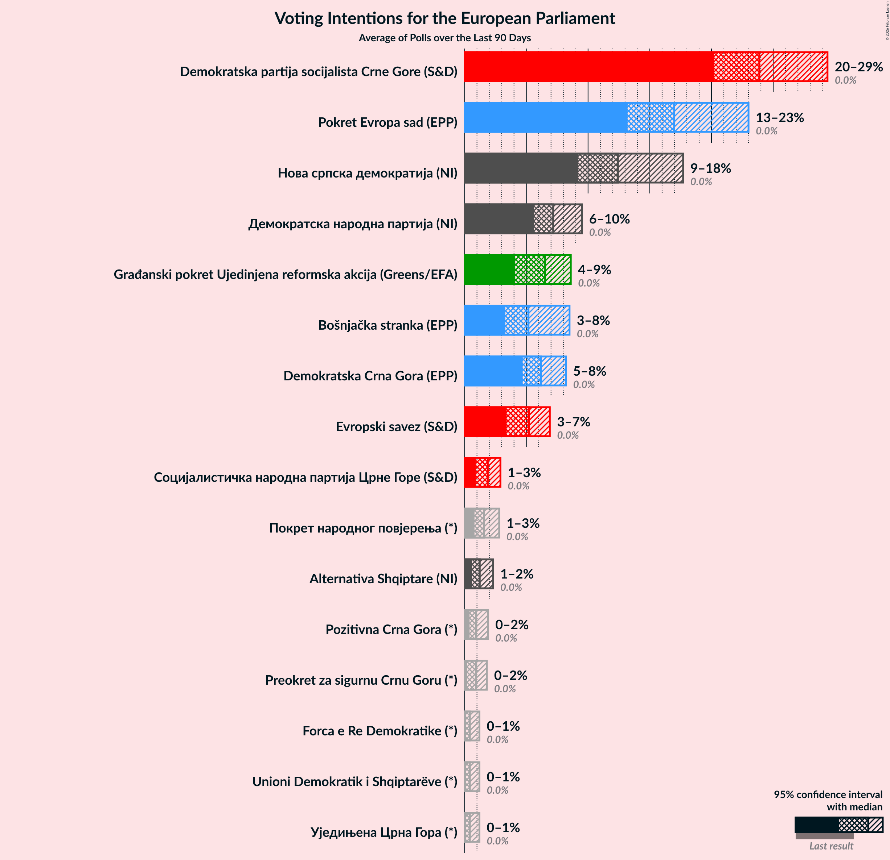

### Confidence Intervals

| Party | Last Result | Median | 80% Confidence Interval | 90% Confidence Interval | 95% Confidence Interval | 99% Confidence Interval |
|:-----:|:-----------:|:------:|:-----------------------:|:-----------------------:|:-----------------------:|:-----------------------:|
| <a href="#građanski-pokret-ujedinjena-reformska-akcija-(greens/efa)">Građanski pokret Ujedinjena reformska akcija (Greens/EFA)</a> | 0.0% | 6.5% | 4.7–8.0% |4.4–8.3% | 4.1–8.6% | 3.6–9.2% |
| <a href="#demokratska-partija-socijalista-crne-gore-(s&d)">Demokratska partija socijalista Crne Gore (S&D)</a> | 0.0% | 23.9% | 21.1–27.9% |20.6–28.7% | 20.2–29.4% | 19.5–30.6% |
| <a href="#evropski-savez-(s&d)">Evropski savez (S&D)</a> | 0.0% | 5.2% | 4.0–6.3% |3.7–6.6% | 3.4–6.9% | 2.9–7.4% |
| <a href="#социјалистичка-народна-партија-црне-горе-(s&d)">Социјалистичка народна партија Црне Горе (S&D)</a> | 0.0% | 1.9% | 1.2–2.5% |1.0–2.7% | 0.9–2.9% | 0.7–3.3% |
| <a href="#bošnjačka-stranka-(epp)">Bošnjačka stranka (EPP)</a> | 0.0% | 5.2% | 3.7–7.6% |3.5–8.1% | 3.3–8.5% | 3.0–9.4% |
| <a href="#demokratska-crna-gora-(epp)">Demokratska Crna Gora (EPP)</a> | 0.0% | 6.2% | 5.2–7.4% |4.9–7.8% | 4.7–8.2% | 4.3–9.0% |
| <a href="#pokret-evropa-sad-(epp)">Pokret Evropa sad (EPP)</a> | 0.0% | 17.0% | 13.9–21.6% |13.5–22.4% | 13.2–23.0% | 12.5–24.2% |
| <a href="#pokret-za-promjene-(ecr)">Pokret za promjene (ECR)</a> | 0.0% | N/A | N/A |N/A | N/A | N/A |
| <a href="#alternativa-shqiptare-(ni)">Alternativa Shqiptare (NI)</a> | 0.0% | 1.2% | 0.8–1.9% |0.6–2.1% | 0.6–2.3% | 0.4–2.8% |
| <a href="#демократска-народна-партија-(ni)">Демократска народна партија (NI)</a> | 0.0% | 7.2% | 6.1–8.6% |5.9–9.0% | 5.6–9.5% | 5.2–10.3% |
| <a href="#нова-српска-демократија-(ni)">Нова српска демократија (NI)</a> | 0.0% | 12.4% | 9.8–16.4% |9.5–17.1% | 9.2–17.7% | 8.6–18.8% |
| <a href="#forca-e-re-demokratike-(*)">Forca e Re Demokratike (*)</a> | 0.0% | 0.4% | 0.2–0.9% |0.1–1.0% | 0.1–1.2% | 0.1–1.5% |
| <a href="#pozitivna-crna-gora-(*)">Pozitivna Crna Gora (*)</a> | 0.0% | 0.9% | 0.5–1.5% |0.4–1.7% | 0.4–1.9% | 0.3–2.3% |
| <a href="#pravda-za-sve-(*)">Pravda za sve (*)</a> | 0.0% | N/A | N/A |N/A | N/A | N/A |
| <a href="#preokret-za-sigurnu-crnu-goru-(*)">Preokret za sigurnu Crnu Goru (*)</a> | 0.0% | 0.9% | 0.4–1.5% |0.3–1.6% | 0.2–1.8% | 0.1–2.1% |
| <a href="#unioni-demokratik-i-shqiptarëve-(*)">Unioni Demokratik i Shqiptarëve (*)</a> | 0.0% | 0.4% | 0.2–0.9% |0.1–1.0% | 0.1–1.2% | 0.1–1.5% |
| <a href="#покрет-народног-повјерења-(*)">Покрет народног повјерења (*)</a> | 0.0% | 1.6% | 1.0–2.3% |0.9–2.5% | 0.8–2.8% | 0.6–3.2% |
| <a href="#уједињена-црна-гора-(*)">Уједињена Црна Гора (*)</a> | 0.0% | 0.4% | 0.2–0.9% |0.1–1.0% | 0.1–1.2% | 0.1–1.5% |

### Покрет народног повјерења (*)

*For a full overview of the results for this party, see the [Покрет народног повјерења (*)](party-покретнародногповјерења.html) page.*

| Voting Intentions | Probability | Accumulated | Special Marks |
|:-----------------:|:-----------:|:-----------:|:-------------:|
| 0.0–0.5% | 0.2% | 100% | Last Result |
| 0.5–1.5% | 49% | 99.8% |  |
| 1.5–2.5% | 46% | 51% | Median |
| 2.5–3.5% | 5% | 5% |  |
| 3.5–4.5% | 0.1% | 0.1% |  |
| 4.5–5.5% | 0% | 0% |  |

### Evropski savez (S&D)

*For a full overview of the results for this party, see the [Evropski savez (S&D)](party-evropskisavezsd.html) page.*

| Voting Intentions | Probability | Accumulated | Special Marks |
|:-----------------:|:-----------:|:-----------:|:-------------:|
| 0.0–0.5% | 0% | 100% | Last Result |
| 0.5–1.5% | 0% | 100% |  |
| 1.5–2.5% | 0.1% | 100% |  |
| 2.5–3.5% | 4% | 99.9% |  |
| 3.5–4.5% | 21% | 96% |  |
| 4.5–5.5% | 40% | 75% | Median |
| 5.5–6.5% | 30% | 35% |  |
| 6.5–7.5% | 5% | 6% |  |
| 7.5–8.5% | 0.3% | 0.3% |  |
| 8.5–9.5% | 0% | 0% |  |

### Pokret Evropa sad (EPP)

*For a full overview of the results for this party, see the [Pokret Evropa sad (EPP)](party-pokretevropasadepp.html) page.*

| Voting Intentions | Probability | Accumulated | Special Marks |
|:-----------------:|:-----------:|:-----------:|:-------------:|
| 0.0–0.5% | 0% | 100% | Last Result |
| 0.5–1.5% | 0% | 100% |  |
| 1.5–2.5% | 0% | 100% |  |
| 2.5–3.5% | 0% | 100% |  |
| 3.5–4.5% | 0% | 100% |  |
| 4.5–5.5% | 0% | 100% |  |
| 5.5–6.5% | 0% | 100% |  |
| 6.5–7.5% | 0% | 100% |  |
| 7.5–8.5% | 0% | 100% |  |
| 8.5–9.5% | 0% | 100% |  |
| 9.5–10.5% | 0% | 100% |  |
| 10.5–11.5% | 0% | 100% |  |
| 11.5–12.5% | 0.5% | 100% |  |
| 12.5–13.5% | 5% | 99.5% |  |
| 13.5–14.5% | 15% | 95% |  |
| 14.5–15.5% | 18% | 79% |  |
| 15.5–16.5% | 9% | 61% |  |
| 16.5–17.5% | 4% | 52% | Median |
| 17.5–18.5% | 5% | 48% |  |
| 18.5–19.5% | 10% | 43% |  |
| 19.5–20.5% | 12% | 33% |  |
| 20.5–21.5% | 11% | 21% |  |
| 21.5–22.5% | 6% | 10% |  |
| 22.5–23.5% | 3% | 4% |  |
| 23.5–24.5% | 0.9% | 1.2% |  |
| 24.5–25.5% | 0.2% | 0.3% |  |
| 25.5–26.5% | 0% | 0% |  |
| 26.5–27.5% | 0% | 0% |  |

### Preokret za sigurnu Crnu Goru (*)

*For a full overview of the results for this party, see the [Preokret za sigurnu Crnu Goru (*)](party-preokretzasigurnucrnugoru.html) page.*

| Voting Intentions | Probability | Accumulated | Special Marks |
|:-----------------:|:-----------:|:-----------:|:-------------:|
| 0.0–0.5% | 22% | 100% | Last Result |
| 0.5–1.5% | 70% | 78% | Median |
| 1.5–2.5% | 7% | 7% |  |
| 2.5–3.5% | 0% | 0% |  |

### Bošnjačka stranka (EPP)

*For a full overview of the results for this party, see the [Bošnjačka stranka (EPP)](party-bošnjačkastrankaepp.html) page.*

| Voting Intentions | Probability | Accumulated | Special Marks |
|:-----------------:|:-----------:|:-----------:|:-------------:|
| 0.0–0.5% | 0% | 100% | Last Result |
| 0.5–1.5% | 0% | 100% |  |
| 1.5–2.5% | 0% | 100% |  |
| 2.5–3.5% | 6% | 100% |  |
| 3.5–4.5% | 31% | 94% |  |
| 4.5–5.5% | 17% | 62% | Median |
| 5.5–6.5% | 17% | 46% |  |
| 6.5–7.5% | 18% | 29% |  |
| 7.5–8.5% | 9% | 11% |  |
| 8.5–9.5% | 2% | 2% |  |
| 9.5–10.5% | 0.3% | 0.3% |  |
| 10.5–11.5% | 0% | 0% |  |

### Pozitivna Crna Gora (*)

*For a full overview of the results for this party, see the [Pozitivna Crna Gora (*)](party-pozitivnacrnagora.html) page.*

| Voting Intentions | Probability | Accumulated | Special Marks |
|:-----------------:|:-----------:|:-----------:|:-------------:|
| 0.0–0.5% | 13% | 100% | Last Result |
| 0.5–1.5% | 79% | 87% | Median |
| 1.5–2.5% | 8% | 8% |  |
| 2.5–3.5% | 0.2% | 0.2% |  |
| 3.5–4.5% | 0% | 0% |  |

### Alternativa Shqiptare (NI)

*For a full overview of the results for this party, see the [Alternativa Shqiptare (NI)](party-alternativashqiptareni.html) page.*

| Voting Intentions | Probability | Accumulated | Special Marks |
|:-----------------:|:-----------:|:-----------:|:-------------:|
| 0.0–0.5% | 2% | 100% | Last Result |
| 0.5–1.5% | 72% | 98% | Median |
| 1.5–2.5% | 25% | 26% |  |
| 2.5–3.5% | 1.1% | 1.1% |  |
| 3.5–4.5% | 0% | 0% |  |

### Социјалистичка народна партија Црне Горе (S&D)

*For a full overview of the results for this party, see the [Социјалистичка народна партија Црне Горе (S&D)](party-социјалистичканароднапартијацрнегореsd.html) page.*

| Voting Intentions | Probability | Accumulated | Special Marks |
|:-----------------:|:-----------:|:-----------:|:-------------:|
| 0.0–0.5% | 0.1% | 100% | Last Result |
| 0.5–1.5% | 28% | 99.9% |  |
| 1.5–2.5% | 62% | 72% | Median |
| 2.5–3.5% | 9% | 9% |  |
| 3.5–4.5% | 0.1% | 0.1% |  |
| 4.5–5.5% | 0% | 0% |  |

### Demokratska partija socijalista Crne Gore (S&D)

*For a full overview of the results for this party, see the [Demokratska partija socijalista Crne Gore (S&D)](party-demokratskapartijasocijalistacrnegoresd.html) page.*

| Voting Intentions | Probability | Accumulated | Special Marks |
|:-----------------:|:-----------:|:-----------:|:-------------:|
| 0.0–0.5% | 0% | 100% | Last Result |
| 0.5–1.5% | 0% | 100% |  |
| 1.5–2.5% | 0% | 100% |  |
| 2.5–3.5% | 0% | 100% |  |
| 3.5–4.5% | 0% | 100% |  |
| 4.5–5.5% | 0% | 100% |  |
| 5.5–6.5% | 0% | 100% |  |
| 6.5–7.5% | 0% | 100% |  |
| 7.5–8.5% | 0% | 100% |  |
| 8.5–9.5% | 0% | 100% |  |
| 9.5–10.5% | 0% | 100% |  |
| 10.5–11.5% | 0% | 100% |  |
| 11.5–12.5% | 0% | 100% |  |
| 12.5–13.5% | 0% | 100% |  |
| 13.5–14.5% | 0% | 100% |  |
| 14.5–15.5% | 0% | 100% |  |
| 15.5–16.5% | 0% | 100% |  |
| 16.5–17.5% | 0% | 100% |  |
| 17.5–18.5% | 0% | 100% |  |
| 18.5–19.5% | 0.6% | 100% |  |
| 19.5–20.5% | 4% | 99.4% |  |
| 20.5–21.5% | 11% | 96% |  |
| 21.5–22.5% | 17% | 84% |  |
| 22.5–23.5% | 14% | 67% |  |
| 23.5–24.5% | 9% | 53% | Median |
| 24.5–25.5% | 9% | 44% |  |
| 25.5–26.5% | 11% | 34% |  |
| 26.5–27.5% | 10% | 23% |  |
| 27.5–28.5% | 7% | 13% |  |
| 28.5–29.5% | 4% | 6% |  |
| 29.5–30.5% | 1.5% | 2% |  |
| 30.5–31.5% | 0.5% | 0.6% |  |
| 31.5–32.5% | 0.1% | 0.1% |  |
| 32.5–33.5% | 0% | 0% |  |

### Нова српска демократија (NI)

*For a full overview of the results for this party, see the [Нова српска демократија (NI)](party-новасрпскадемократијаni.html) page.*

| Voting Intentions | Probability | Accumulated | Special Marks |
|:-----------------:|:-----------:|:-----------:|:-------------:|
| 0.0–0.5% | 0% | 100% | Last Result |
| 0.5–1.5% | 0% | 100% |  |
| 1.5–2.5% | 0% | 100% |  |
| 2.5–3.5% | 0% | 100% |  |
| 3.5–4.5% | 0% | 100% |  |
| 4.5–5.5% | 0% | 100% |  |
| 5.5–6.5% | 0% | 100% |  |
| 6.5–7.5% | 0% | 100% |  |
| 7.5–8.5% | 0.4% | 100% |  |
| 8.5–9.5% | 6% | 99.6% |  |
| 9.5–10.5% | 19% | 94% |  |
| 10.5–11.5% | 19% | 75% |  |
| 11.5–12.5% | 7% | 57% | Median |
| 12.5–13.5% | 5% | 49% |  |
| 13.5–14.5% | 10% | 44% |  |
| 14.5–15.5% | 13% | 34% |  |
| 15.5–16.5% | 11% | 20% |  |
| 16.5–17.5% | 6% | 9% |  |
| 17.5–18.5% | 2% | 3% |  |
| 18.5–19.5% | 0.6% | 0.7% |  |
| 19.5–20.5% | 0.1% | 0.1% |  |
| 20.5–21.5% | 0% | 0% |  |

### Демократска народна партија (NI)

*For a full overview of the results for this party, see the [Демократска народна партија (NI)](party-демократсканароднапартијаni.html) page.*

| Voting Intentions | Probability | Accumulated | Special Marks |
|:-----------------:|:-----------:|:-----------:|:-------------:|
| 0.0–0.5% | 0% | 100% | Last Result |
| 0.5–1.5% | 0% | 100% |  |
| 1.5–2.5% | 0% | 100% |  |
| 2.5–3.5% | 0% | 100% |  |
| 3.5–4.5% | 0% | 100% |  |
| 4.5–5.5% | 2% | 100% |  |
| 5.5–6.5% | 21% | 98% |  |
| 6.5–7.5% | 41% | 77% | Median |
| 7.5–8.5% | 25% | 36% |  |
| 8.5–9.5% | 8% | 10% |  |
| 9.5–10.5% | 2% | 2% |  |
| 10.5–11.5% | 0.3% | 0.3% |  |
| 11.5–12.5% | 0% | 0% |  |

### Forca e Re Demokratike (*)

*For a full overview of the results for this party, see the [Forca e Re Demokratike (*)](party-forcaeredemokratike.html) page.*

| Voting Intentions | Probability | Accumulated | Special Marks |
|:-----------------:|:-----------:|:-----------:|:-------------:|
| 0.0–0.5% | 66% | 100% | Last Result, Median |
| 0.5–1.5% | 34% | 34% |  |
| 1.5–2.5% | 0.4% | 0.4% |  |
| 2.5–3.5% | 0% | 0% |  |

### Građanski pokret Ujedinjena reformska akcija (Greens/EFA)

*For a full overview of the results for this party, see the [Građanski pokret Ujedinjena reformska akcija (Greens/EFA)](party-građanskipokretujedinjenareformskaakcijagreensefa.html) page.*

| Voting Intentions | Probability | Accumulated | Special Marks |
|:-----------------:|:-----------:|:-----------:|:-------------:|
| 0.0–0.5% | 0% | 100% | Last Result |
| 0.5–1.5% | 0% | 100% |  |
| 1.5–2.5% | 0% | 100% |  |
| 2.5–3.5% | 0.4% | 100% |  |
| 3.5–4.5% | 7% | 99.6% |  |
| 4.5–5.5% | 20% | 93% |  |
| 5.5–6.5% | 23% | 73% |  |
| 6.5–7.5% | 29% | 50% | Median |
| 7.5–8.5% | 17% | 20% |  |
| 8.5–9.5% | 3% | 3% |  |
| 9.5–10.5% | 0.1% | 0.1% |  |
| 10.5–11.5% | 0% | 0% |  |

### Unioni Demokratik i Shqiptarëve (*)

*For a full overview of the results for this party, see the [Unioni Demokratik i Shqiptarëve (*)](party-unionidemokratikishqiptarëve.html) page.*

| Voting Intentions | Probability | Accumulated | Special Marks |
|:-----------------:|:-----------:|:-----------:|:-------------:|
| 0.0–0.5% | 66% | 100% | Last Result, Median |
| 0.5–1.5% | 34% | 34% |  |
| 1.5–2.5% | 0.4% | 0.4% |  |
| 2.5–3.5% | 0% | 0% |  |

### Уједињена Црна Гора (*)

*For a full overview of the results for this party, see the [Уједињена Црна Гора (*)](party-уједињенацрнагора.html) page.*

| Voting Intentions | Probability | Accumulated | Special Marks |
|:-----------------:|:-----------:|:-----------:|:-------------:|
| 0.0–0.5% | 66% | 100% | Last Result, Median |
| 0.5–1.5% | 34% | 34% |  |
| 1.5–2.5% | 0.4% | 0.4% |  |
| 2.5–3.5% | 0% | 0% |  |

### Demokratska Crna Gora (EPP)

*For a full overview of the results for this party, see the [Demokratska Crna Gora (EPP)](party-demokratskacrnagoraepp.html) page.*

| Voting Intentions | Probability | Accumulated | Special Marks |
|:-----------------:|:-----------:|:-----------:|:-------------:|
| 0.0–0.5% | 0% | 100% | Last Result |
| 0.5–1.5% | 0% | 100% |  |
| 1.5–2.5% | 0% | 100% |  |
| 2.5–3.5% | 0% | 100% |  |
| 3.5–4.5% | 1.4% | 100% |  |
| 4.5–5.5% | 21% | 98.5% |  |
| 5.5–6.5% | 46% | 78% | Median |
| 6.5–7.5% | 24% | 32% |  |
| 7.5–8.5% | 7% | 8% |  |
| 8.5–9.5% | 1.1% | 1.3% |  |
| 9.5–10.5% | 0.1% | 0.1% |  |
| 10.5–11.5% | 0% | 0% |  |

## Seats

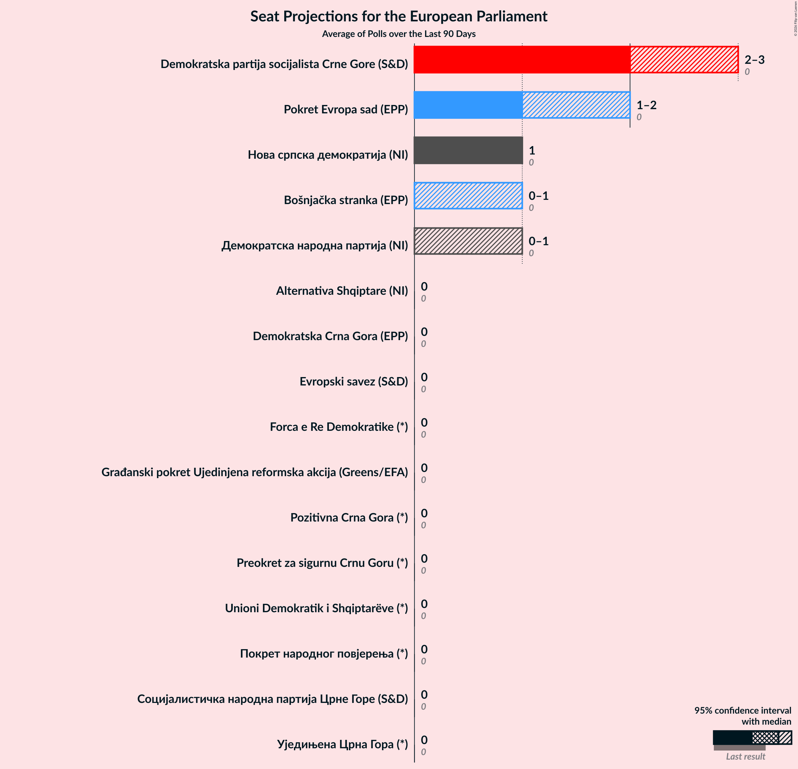

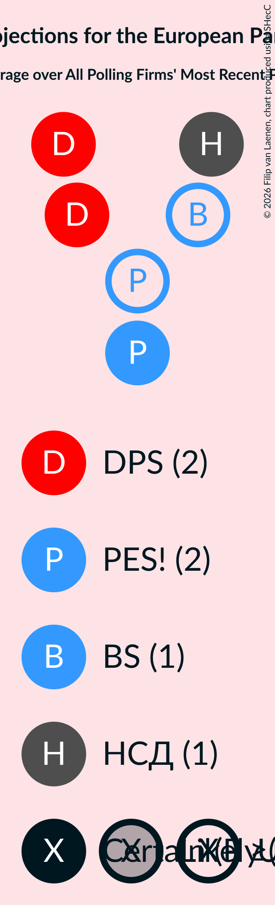

### Confidence Intervals

| Party | Last Result | Median | 80% Confidence Interval | 90% Confidence Interval | 95% Confidence Interval | 99% Confidence Interval |
|:-----:|:-----------:|:------:|:-----------------------:|:-----------------------:|:-----------------------:|:-----------------------:|
| <a href="#građanski-pokret-ujedinjena-reformska-akcija-(greens/efa)">Građanski pokret Ujedinjena reformska akcija (Greens/EFA)</a> | 0 | 0 | 0–1 |0–1 | 0–1 | 0–1 |
| <a href="#demokratska-partija-socijalista-crne-gore-(s&d)">Demokratska partija socijalista Crne Gore (S&D)</a> | 0 | 2 | 2–3 |2–3 | 2–3 | 2–3 |
| <a href="#evropski-savez-(s&d)">Evropski savez (S&D)</a> | 0 | 0 | 0 |0 | 0 | 0 |
| <a href="#социјалистичка-народна-партија-црне-горе-(s&d)">Социјалистичка народна партија Црне Горе (S&D)</a> | 0 | 0 | 0 |0 | 0 | 0 |
| <a href="#bošnjačka-stranka-(epp)">Bošnjačka stranka (EPP)</a> | 0 | 0 | 0–1 |0–1 | 0–1 | 0–1 |
| <a href="#demokratska-crna-gora-(epp)">Demokratska Crna Gora (EPP)</a> | 0 | 0 | 0 |0 | 0 | 0–1 |
| <a href="#pokret-evropa-sad-(epp)">Pokret Evropa sad (EPP)</a> | 0 | 1 | 1–2 |1–2 | 1–2 | 1–2 |
| <a href="#pokret-za-promjene-(ecr)">Pokret za promjene (ECR)</a> | 0 | N/A | N/A |N/A | N/A | N/A |
| <a href="#alternativa-shqiptare-(ni)">Alternativa Shqiptare (NI)</a> | 0 | 0 | 0 |0 | 0 | 0 |
| <a href="#демократска-народна-партија-(ni)">Демократска народна партија (NI)</a> | 0 | 1 | 0–1 |0–1 | 0–1 | 0–1 |
| <a href="#нова-српска-демократија-(ni)">Нова српска демократија (NI)</a> | 0 | 1 | 1–2 |1–2 | 1–2 | 1–2 |
| <a href="#forca-e-re-demokratike-(*)">Forca e Re Demokratike (*)</a> | 0 | 0 | 0 |0 | 0 | 0 |
| <a href="#pozitivna-crna-gora-(*)">Pozitivna Crna Gora (*)</a> | 0 | 0 | 0 |0 | 0 | 0 |
| <a href="#pravda-za-sve-(*)">Pravda za sve (*)</a> | 0 | N/A | N/A |N/A | N/A | N/A |
| <a href="#preokret-za-sigurnu-crnu-goru-(*)">Preokret za sigurnu Crnu Goru (*)</a> | 0 | 0 | 0 |0 | 0 | 0 |
| <a href="#unioni-demokratik-i-shqiptarëve-(*)">Unioni Demokratik i Shqiptarëve (*)</a> | 0 | 0 | 0 |0 | 0 | 0 |
| <a href="#покрет-народног-повјерења-(*)">Покрет народног повјерења (*)</a> | 0 | 0 | 0 |0 | 0 | 0 |
| <a href="#уједињена-црна-гора-(*)">Уједињена Црна Гора (*)</a> | 0 | 0 | 0 |0 | 0 | 0 |

### Građanski pokret Ujedinjena reformska akcija (Greens/EFA)

*For a full overview of the results for this party, see the [Građanski pokret Ujedinjena reformska akcija (Greens/EFA)](party-građanskipokretujedinjenareformskaakcijagreensefa.html) page.*

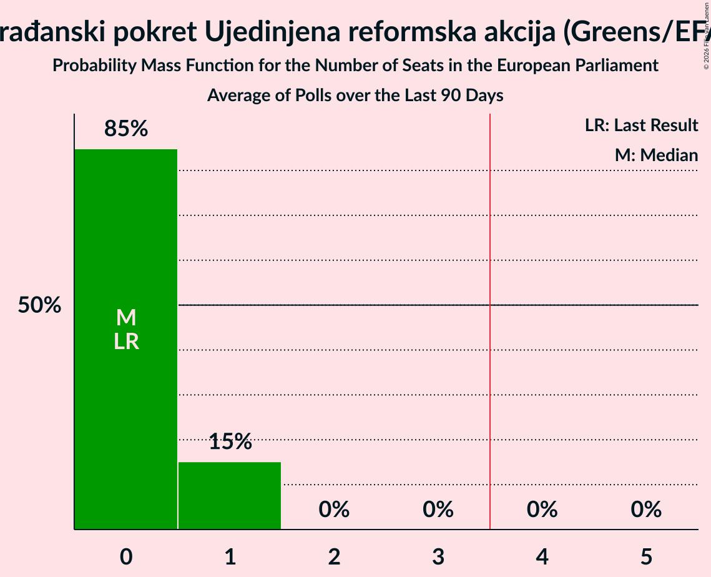

| Number of Seats | Probability | Accumulated | Special Marks |
|:---------------:|:-----------:|:-----------:|:-------------:|
| 0 | 85% | 100% | Last Result, Median |
| 1 | 15% | 15% |  |
| 2 | 0% | 0% |  |

### Demokratska partija socijalista Crne Gore (S&D)

*For a full overview of the results for this party, see the [Demokratska partija socijalista Crne Gore (S&D)](party-demokratskapartijasocijalistacrnegoresd.html) page.*

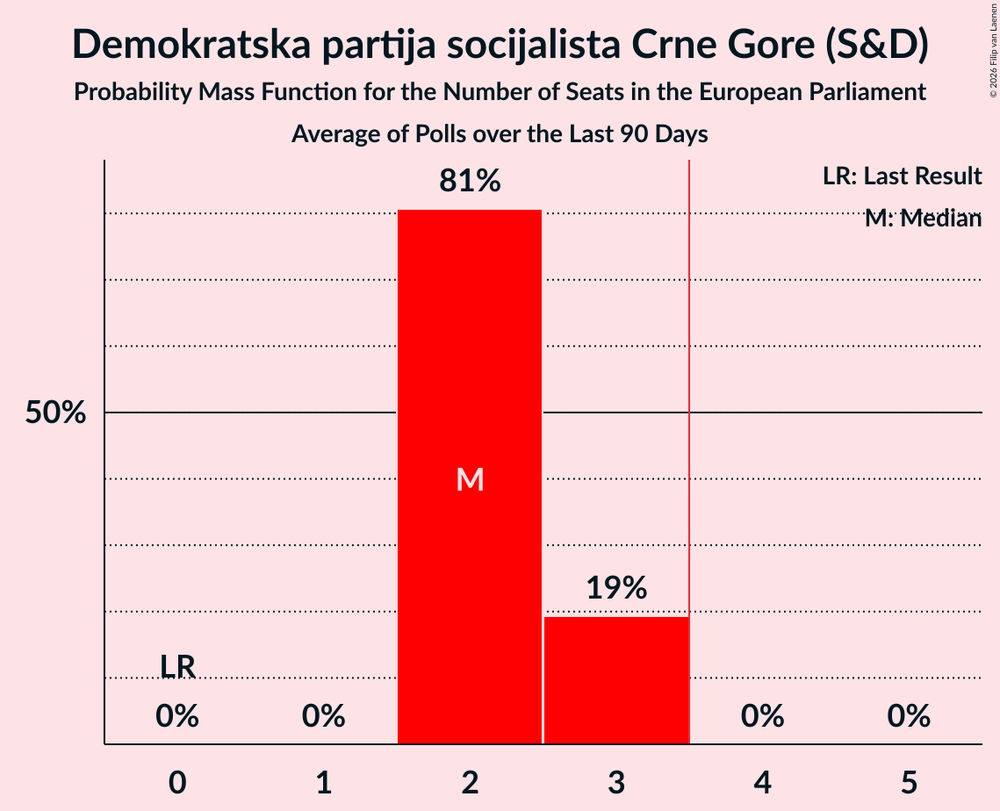

| Number of Seats | Probability | Accumulated | Special Marks |
|:---------------:|:-----------:|:-----------:|:-------------:|
| 0 | 0% | 100% | Last Result |
| 1 | 0% | 100% |  |
| 2 | 81% | 100% | Median |
| 3 | 19% | 19% |  |
| 4 | 0% | 0% | Majority |

### Evropski savez (S&D)

*For a full overview of the results for this party, see the [Evropski savez (S&D)](party-evropskisavezsd.html) page.*

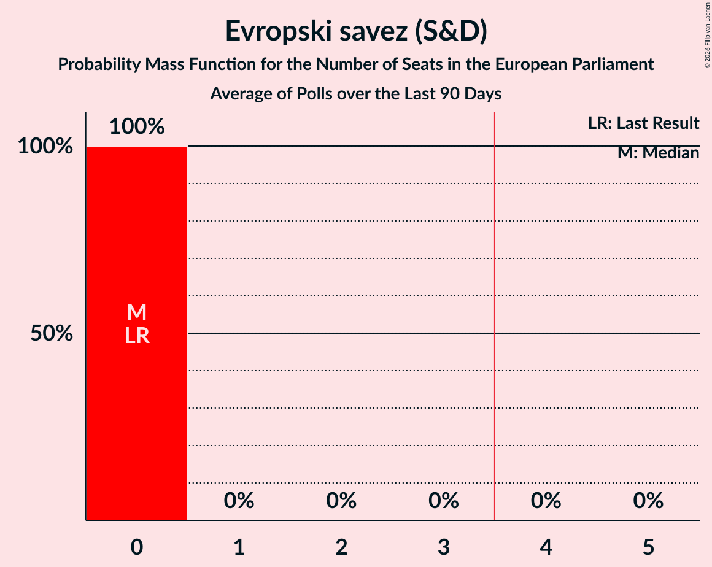

| Number of Seats | Probability | Accumulated | Special Marks |
|:---------------:|:-----------:|:-----------:|:-------------:|
| 0 | 99.7% | 100% | Last Result, Median |
| 1 | 0.3% | 0.3% |  |
| 2 | 0% | 0% |  |

### Социјалистичка народна партија Црне Горе (S&D)

*For a full overview of the results for this party, see the [Социјалистичка народна партија Црне Горе (S&D)](party-социјалистичканароднапартијацрнегореsd.html) page.*

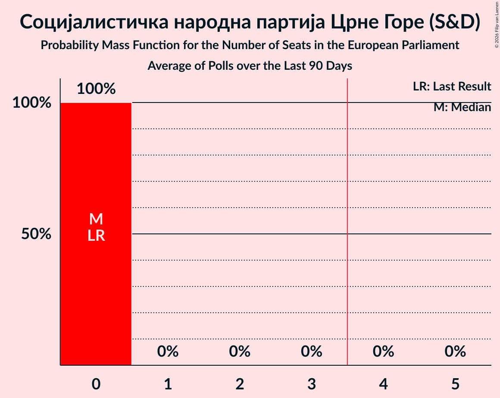

| Number of Seats | Probability | Accumulated | Special Marks |
|:---------------:|:-----------:|:-----------:|:-------------:|
| 0 | 100% | 100% | Last Result, Median |

### Bošnjačka stranka (EPP)

*For a full overview of the results for this party, see the [Bošnjačka stranka (EPP)](party-bošnjačkastrankaepp.html) page.*

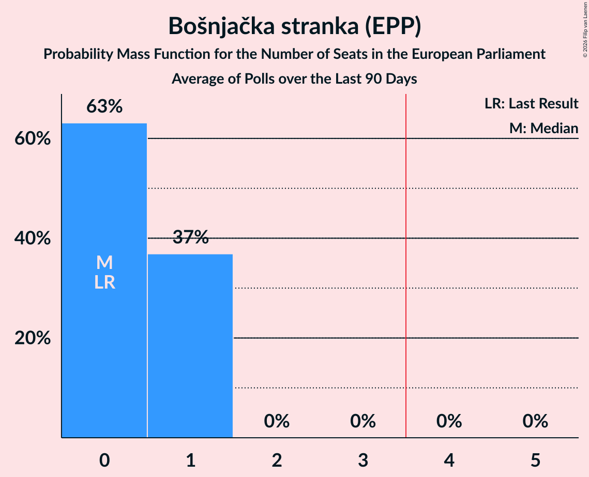

| Number of Seats | Probability | Accumulated | Special Marks |
|:---------------:|:-----------:|:-----------:|:-------------:|
| 0 | 57% | 100% | Last Result, Median |
| 1 | 43% | 43% |  |
| 2 | 0% | 0% |  |

### Demokratska Crna Gora (EPP)

*For a full overview of the results for this party, see the [Demokratska Crna Gora (EPP)](party-demokratskacrnagoraepp.html) page.*

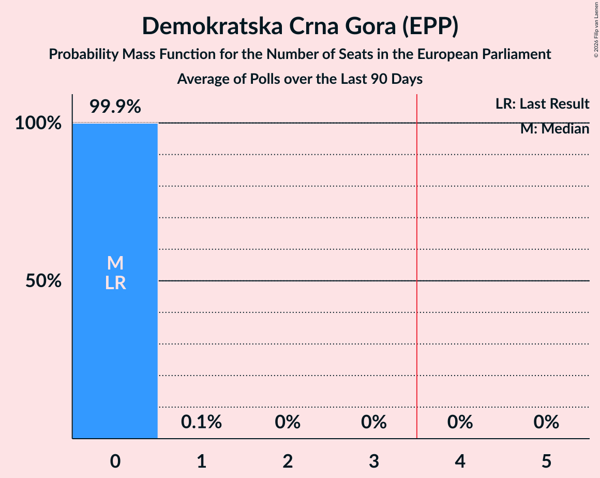

| Number of Seats | Probability | Accumulated | Special Marks |
|:---------------:|:-----------:|:-----------:|:-------------:|
| 0 | 99.3% | 100% | Last Result, Median |
| 1 | 0.7% | 0.7% |  |
| 2 | 0% | 0% |  |

### Pokret Evropa sad (EPP)

*For a full overview of the results for this party, see the [Pokret Evropa sad (EPP)](party-pokretevropasadepp.html) page.*

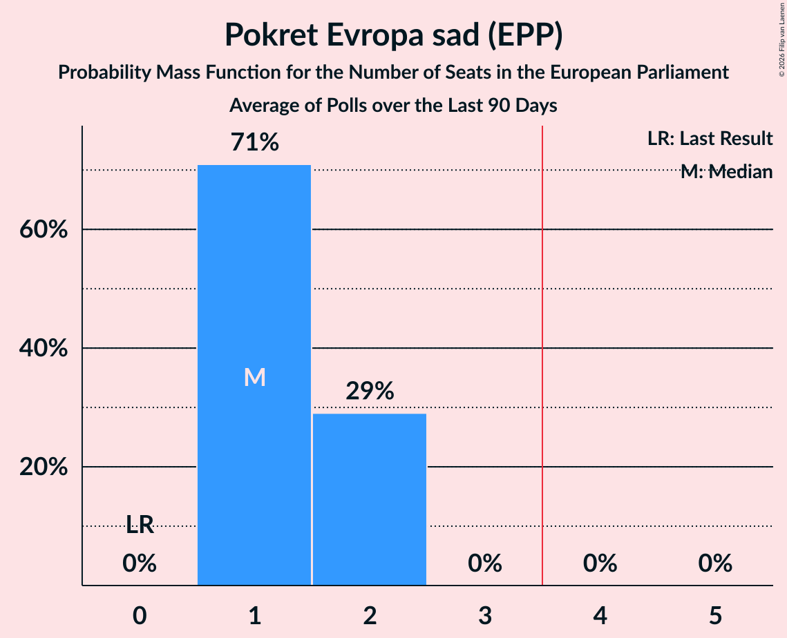

| Number of Seats | Probability | Accumulated | Special Marks |
|:---------------:|:-----------:|:-----------:|:-------------:|
| 0 | 0% | 100% | Last Result |
| 1 | 77% | 100% | Median |
| 2 | 23% | 23% |  |
| 3 | 0% | 0% |  |

### Pokret za promjene (ECR)

*For a full overview of the results for this party, see the [Pokret za promjene (ECR)](party-pokretzapromjeneecr.html) page.*

### Alternativa Shqiptare (NI)

*For a full overview of the results for this party, see the [Alternativa Shqiptare (NI)](party-alternativashqiptareni.html) page.*

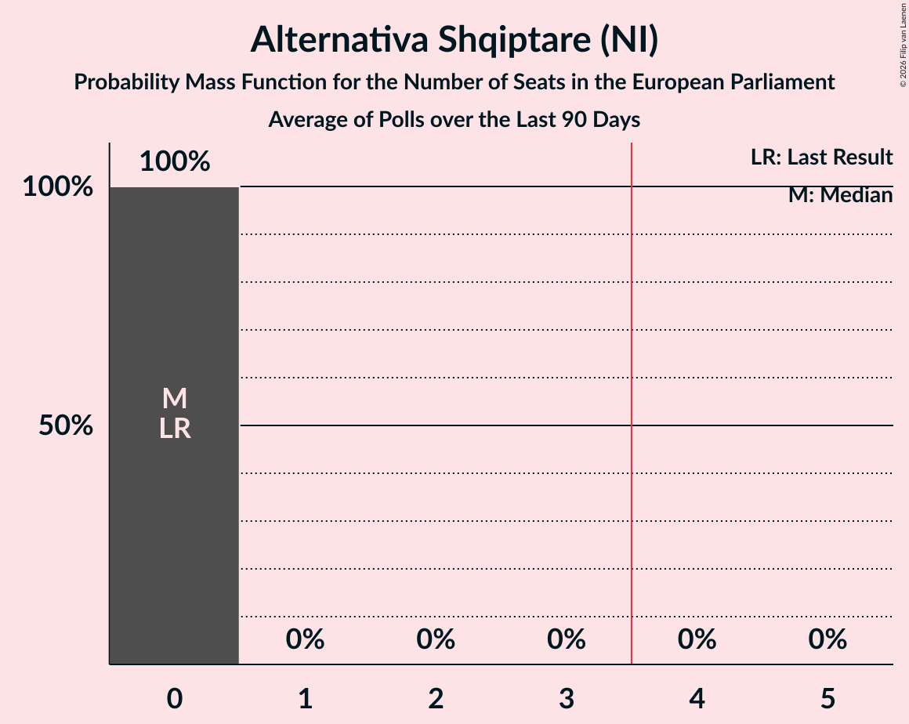

| Number of Seats | Probability | Accumulated | Special Marks |
|:---------------:|:-----------:|:-----------:|:-------------:|
| 0 | 100% | 100% | Last Result, Median |

### Демократска народна партија (NI)

*For a full overview of the results for this party, see the [Демократска народна партија (NI)](party-демократсканароднапартијаni.html) page.*

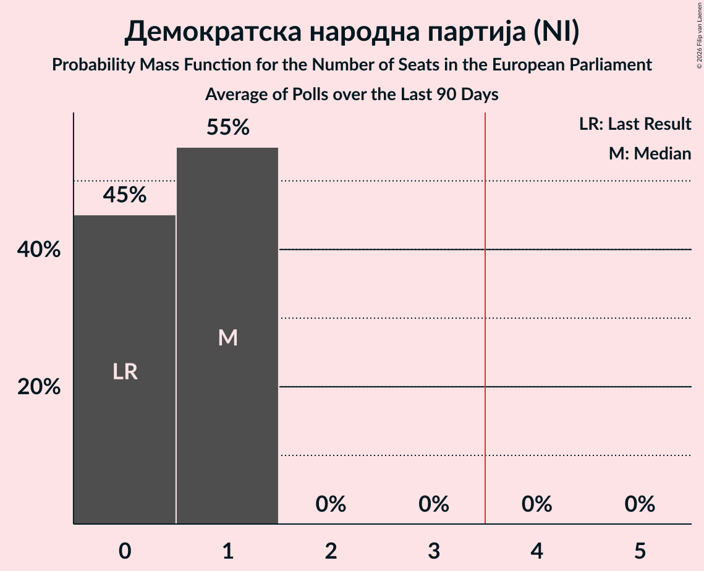

| Number of Seats | Probability | Accumulated | Special Marks |
|:---------------:|:-----------:|:-----------:|:-------------:|
| 0 | 44% | 100% | Last Result |
| 1 | 56% | 56% | Median |
| 2 | 0% | 0% |  |

### Нова српска демократија (NI)

*For a full overview of the results for this party, see the [Нова српска демократија (NI)](party-новасрпскадемократијаni.html) page.*

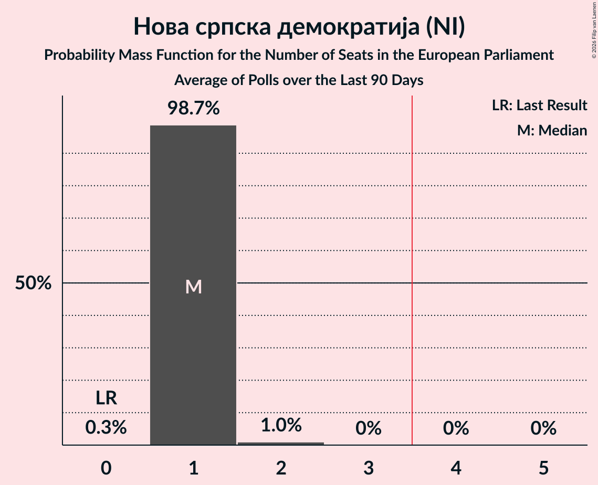

| Number of Seats | Probability | Accumulated | Special Marks |
|:---------------:|:-----------:|:-----------:|:-------------:|
| 0 | 0% | 100% | Last Result |
| 1 | 57% | 100% | Median |
| 2 | 43% | 43% |  |
| 3 | 0% | 0% |  |

### Forca e Re Demokratike (*)

*For a full overview of the results for this party, see the [Forca e Re Demokratike (*)](party-forcaeredemokratike.html) page.*

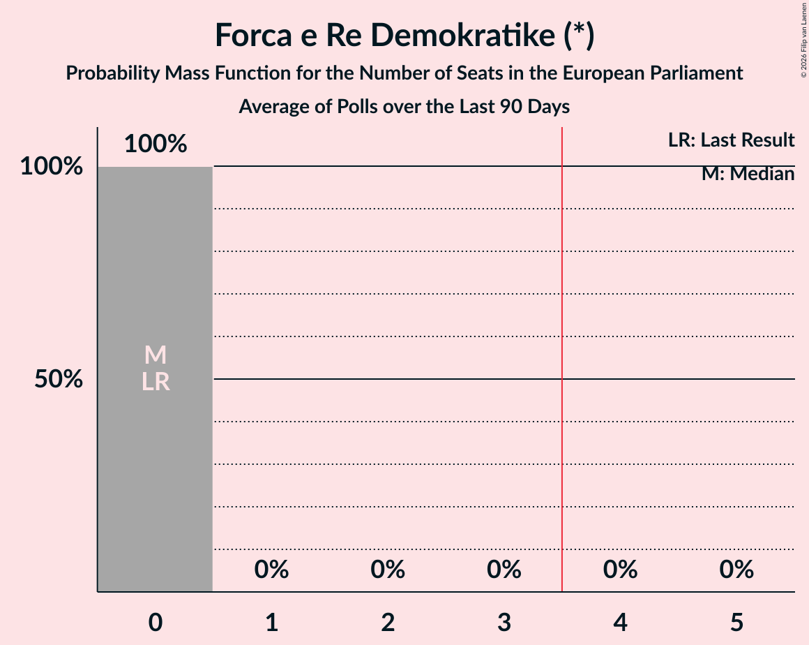

| Number of Seats | Probability | Accumulated | Special Marks |
|:---------------:|:-----------:|:-----------:|:-------------:|
| 0 | 100% | 100% | Last Result, Median |

### Pozitivna Crna Gora (*)

*For a full overview of the results for this party, see the [Pozitivna Crna Gora (*)](party-pozitivnacrnagora.html) page.*

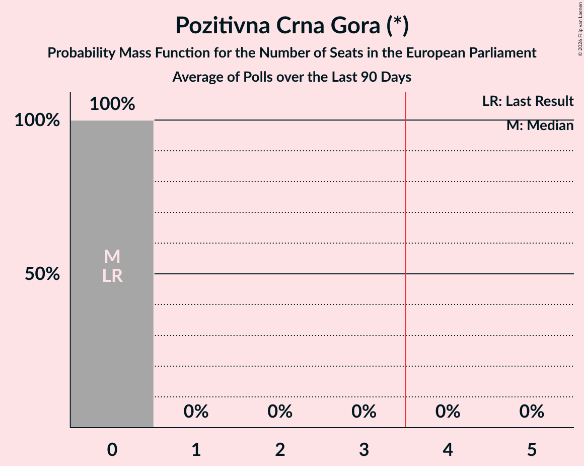

| Number of Seats | Probability | Accumulated | Special Marks |
|:---------------:|:-----------:|:-----------:|:-------------:|
| 0 | 100% | 100% | Last Result, Median |

### Pravda za sve (*)

*For a full overview of the results for this party, see the [Pravda za sve (*)](party-pravdazasve.html) page.*

### Preokret za sigurnu Crnu Goru (*)

*For a full overview of the results for this party, see the [Preokret za sigurnu Crnu Goru (*)](party-preokretzasigurnucrnugoru.html) page.*

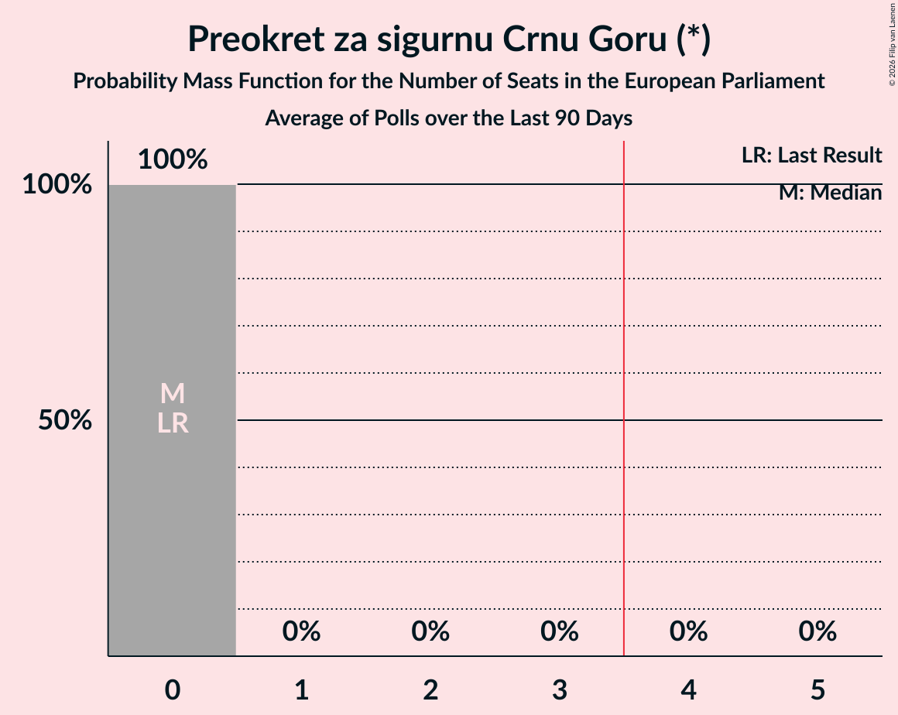

| Number of Seats | Probability | Accumulated | Special Marks |
|:---------------:|:-----------:|:-----------:|:-------------:|
| 0 | 100% | 100% | Last Result, Median |

### Unioni Demokratik i Shqiptarëve (*)

*For a full overview of the results for this party, see the [Unioni Demokratik i Shqiptarëve (*)](party-unionidemokratikishqiptarëve.html) page.*

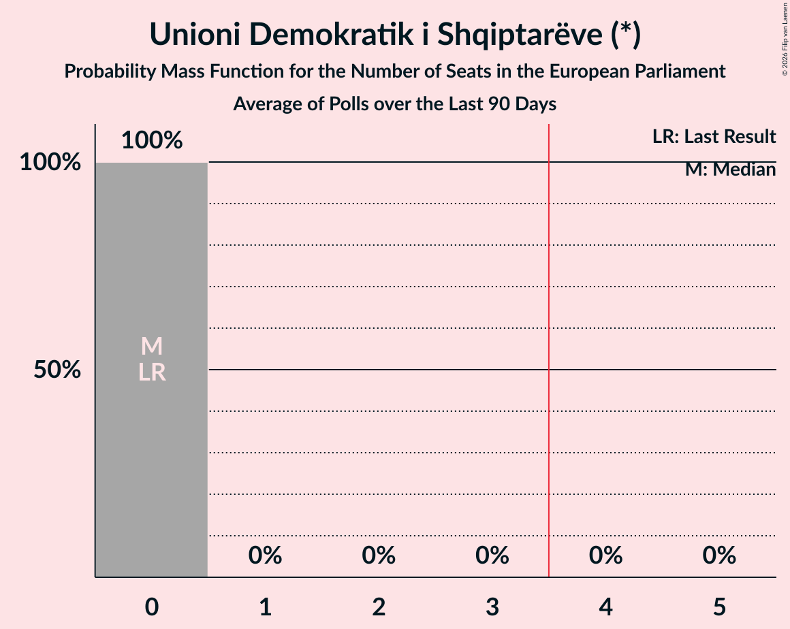

| Number of Seats | Probability | Accumulated | Special Marks |
|:---------------:|:-----------:|:-----------:|:-------------:|
| 0 | 100% | 100% | Last Result, Median |

### Покрет народног повјерења (*)

*For a full overview of the results for this party, see the [Покрет народног повјерења (*)](party-покретнародногповјерења.html) page.*

| Number of Seats | Probability | Accumulated | Special Marks |
|:---------------:|:-----------:|:-----------:|:-------------:|
| 0 | 100% | 100% | Last Result, Median |

### Уједињена Црна Гора (*)

*For a full overview of the results for this party, see the [Уједињена Црна Гора (*)](party-уједињенацрнагора.html) page.*

| Number of Seats | Probability | Accumulated | Special Marks |
|:---------------:|:-----------:|:-----------:|:-------------:|
| 0 | 100% | 100% | Last Result, Median |

## Coalitions

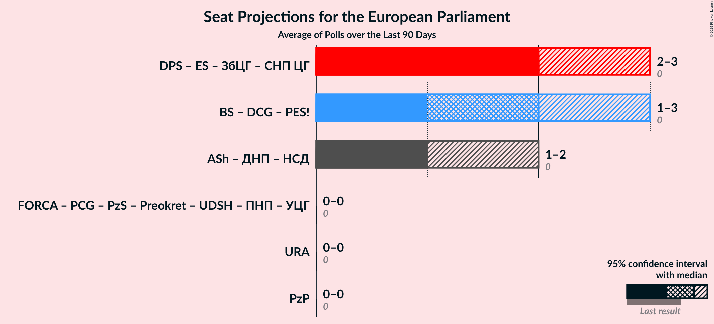

### Confidence Intervals

| Coalition | Last Result | Median | Majority? | 80% Confidence Interval | 90% Confidence Interval | 95% Confidence Interval | 99% Confidence Interval |
|:---------:|:-----------:|:------:|:---------:|:-----------------------:|:-----------------------:|:-----------------------:|:-----------------------:|
| Demokratska partija socijalista Crne Gore (S&D) – Evropski savez (S&D) – Социјалистичка народна партија Црне Горе (S&D) | 0 | 2 | 0% | 2–3 | 2–3 | 2–3 | 2–3 |
| Alternativa Shqiptare (NI) – Демократска народна партија (NI) – Нова српска демократија (NI) | 0 | 2 | 0% | 2 | 2 | 2 | 1–2 |
| Bošnjačka stranka (EPP) – Demokratska Crna Gora (EPP) – Pokret Evropa sad (EPP) | 0 | 2 | 0% | 1–2 | 1–2 | 1–2 | 1–2 |
| Građanski pokret Ujedinjena reformska akcija (Greens/EFA) | 0 | 0 | 0% | 0–1 | 0–1 | 0–1 | 0–1 |
| Forca e Re Demokratike (*) – Pozitivna Crna Gora (*) – Pravda za sve (*) – Preokret za sigurnu Crnu Goru (*) – Unioni Demokratik i Shqiptarëve (*) – Покрет народног повјерења (*) – Уједињена Црна Гора (*) | 0 | 0 | 0% | 0 | 0 | 0 | 0 |
| Pokret za promjene (ECR) | 0 | 0 | 0% | 0 | 0 | 0 | 0 |

### Demokratska partija socijalista Crne Gore (S&D) – Evropski savez (S&D) – Социјалистичка народна партија Црне Горе (S&D)

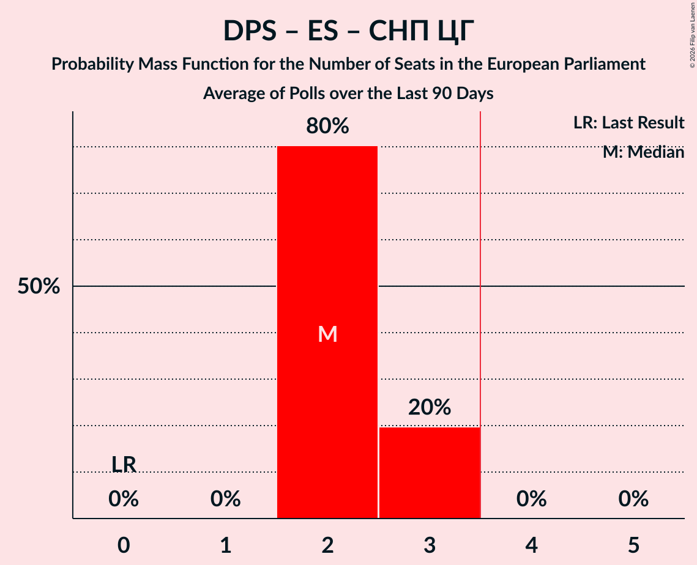

| Number of Seats | Probability | Accumulated | Special Marks |
|:---------------:|:-----------:|:-----------:|:-------------:|
| 0 | 0% | 100% | Last Result |
| 1 | 0% | 100% |  |
| 2 | 80% | 100% | Median |
| 3 | 20% | 20% |  |
| 4 | 0% | 0% | Majority |

### Alternativa Shqiptare (NI) – Демократска народна партија (NI) – Нова српска демократија (NI)

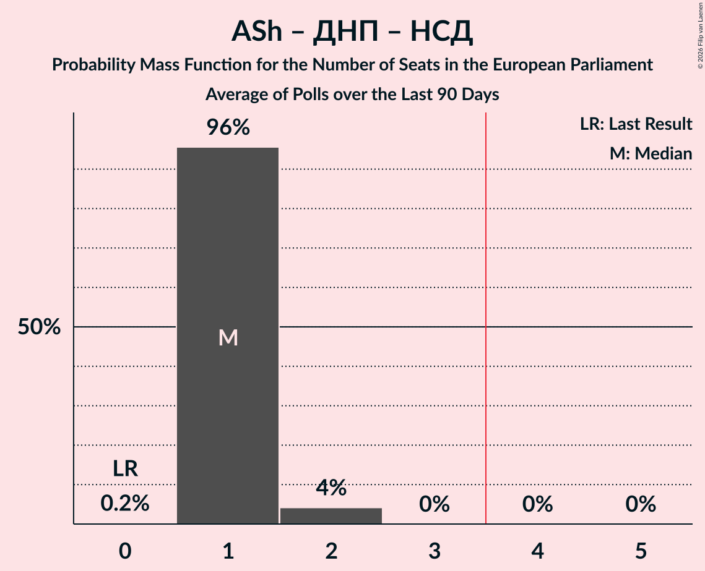

| Number of Seats | Probability | Accumulated | Special Marks |
|:---------------:|:-----------:|:-----------:|:-------------:|
| 0 | 0% | 100% | Last Result |
| 1 | 1.0% | 100% |  |
| 2 | 99.0% | 99.0% | Median |
| 3 | 0% | 0% |  |

### Bošnjačka stranka (EPP) – Demokratska Crna Gora (EPP) – Pokret Evropa sad (EPP)

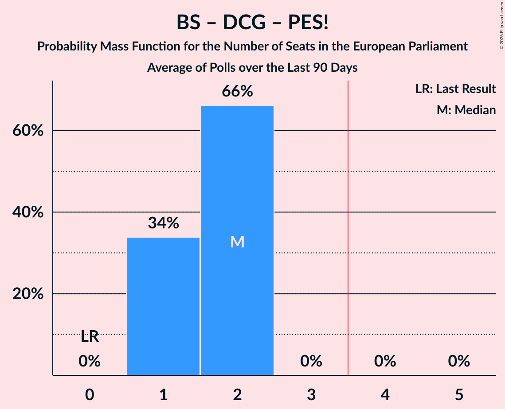

| Number of Seats | Probability | Accumulated | Special Marks |
|:---------------:|:-----------:|:-----------:|:-------------:|
| 0 | 0% | 100% | Last Result |
| 1 | 34% | 100% | Median |
| 2 | 66% | 66% |  |
| 3 | 0% | 0% |  |

### Građanski pokret Ujedinjena reformska akcija (Greens/EFA)

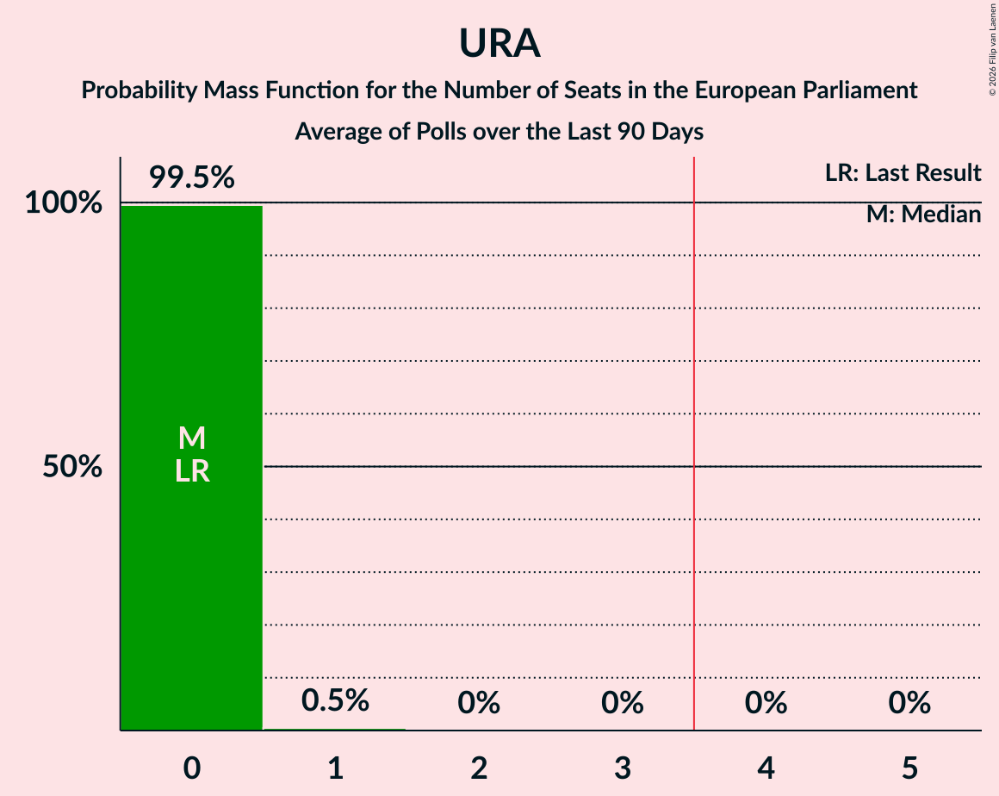

| Number of Seats | Probability | Accumulated | Special Marks |
|:---------------:|:-----------:|:-----------:|:-------------:|
| 0 | 85% | 100% | Last Result, Median |
| 1 | 15% | 15% |  |
| 2 | 0% | 0% |  |

### Forca e Re Demokratike (*) – Pozitivna Crna Gora (*) – Pravda za sve (*) – Preokret za sigurnu Crnu Goru (*) – Unioni Demokratik i Shqiptarëve (*) – Покрет народног повјерења (*) – Уједињена Црна Гора (*)

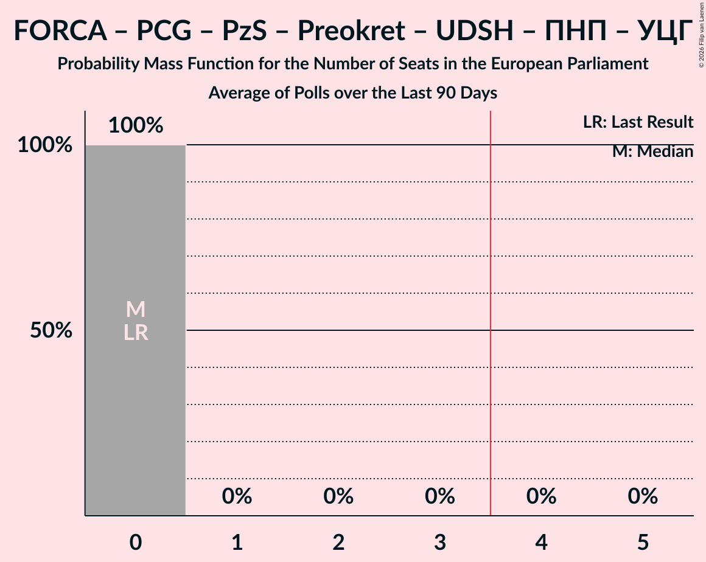

| Number of Seats | Probability | Accumulated | Special Marks |
|:---------------:|:-----------:|:-----------:|:-------------:|
| 0 | 100% | 100% | Last Result, Median |

### Pokret za promjene (ECR)

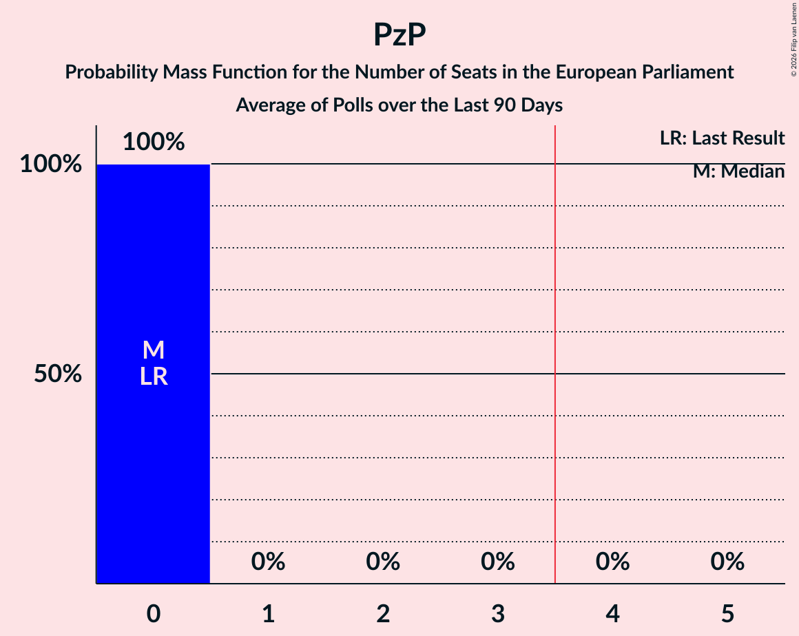

| Number of Seats | Probability | Accumulated | Special Marks |
|:---------------:|:-----------:|:-----------:|:-------------:|
| 0 | 100% | 100% | Last Result, Median |

## Technical Information

+ **Number of polls included in this average:** 2
+ **Lowest number of simulations done in a poll included in this average:** 1,048,576
+ **Total number of simulations done in the polls included in this average:** 2,097,152
+ **Error estimate:** 2.35%
